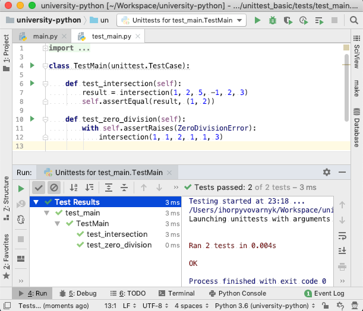
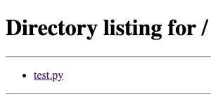

[Draft 2] [[pdf](./(Draft-2)-Лекція-13:-Автоматизоване-тестування.pdf)]

Лекція 13: Автоматизоване тестування
====================================

# Вступ

Виявлення помилок (тестування) завжди було невід’ємною частиною розробки програмного забезпечення (ПЗ). Причини помилок можуть бути різноманітні: неправильна реалізація алгоритмів, неочікувані вхідні дані, помилки у сторонньому ПЗ необхідному для роботи системи. Тестування дозволяє виявляти такі помилки, а його інтеграція в процес розробки дозволяє виявляти їх раніше.

Навіть попередньо протестована програма, після внесення будь-яких змін стає таким-собі котом Шредінгера, не можна бути впевненим чи працює вона коректно чи ні допоки це не буде явно перевірено. Тестування після внесення змін дозволяє легко перевірити коректність роботи як вже зробленого так і нового функціоналу, а його автоматизація робить цей процес швидким.

У сфері розробки ПЗ помилки часто називають англіцизмом “баг” чи ”баґ” (англ. Bug – жук, комаха). Широкому використанню даного терміну сприяв інцидент з Гарвардським комп’ютером Марк ІІ, коли Ґрейс Гоппер виявила, що причиною некоректної роботи комп’ютера стала міль, що застрягла у реле [*].

Хоч за роки розвитку індустрії розробки ПЗ способи та інструменти, що використовуються для виявлення помилок, змінювались на розвивались, однак мета залишилась тією самою: виявлення та локалізація помилок, прагнення до забезпечення повторюваності результатів перевірок.

В даній лекції будуть розглянуті основи теорії тестування ПЗ, а також інструменти, що використовуються для написання автоматизованих тестів мовою Python.

\* Rear Admiral Grace Murray Hopper (http://ei.cs.vt.edu/~history/Hopper.Danis.html)

# Основи теорії тестування програмного забезпечення

Тестування програмного забезпечення — це процес дослідження програмного забезпечення для виявлення інформації про якість цього програмного забезпечення відносно контексту в якому воно має використовуватись. 

## Типи тестування

### Функціональне та нефункціональне тестування

Базуючись на такому широкому визначення тестування ПЗ виділяють такі два типи тестування:

* Функціональне (Functional) — тестування функціоналу системи, що заданий документацією чи описом того, як користувач має з системою взаємодіяти; функціональне тестування відповідає на питання “чи може користувач виконувати певну дію?” або “чи якийсь конкретний шматок функціоналу працює коректно?”;
* Нефункціональне (Non-functional) — стосується аспектів програмного забезпечення, що напряму не стосуються конкретної частини функціоналу чи взаємодії з користувачем, наприклад: масштабування, швидкість роботи, відповідність стандартам безпеки і т.д.

Часто розробники обмежуються лише функціональним тестуванням, покладаючись на нефункціональні характеристики сторонніх бібліотек та інструментів, що використовує система. Однак іноді причина нефункціональних проблем є саме у коді системи, незважаючи на швидкодію чи безпеку сторонніх компонентів. Також самі сторонні компоненти іноді можуть не відповідати нефункціональним вимогам, що може створити серйозні проблеми якщо архітектура системи побудована навколо цих сторонніх компонентів.

### Ручне та автоматизоване тестування

У контексті способу виконання тестів виділяють ручне та автоматизоване тестування:

* Ручне тестування — тестування системи виконується людиною;
* Автоматизоване тестування — тестування системи виконується іншою програмою, а людина лише ініціює цей процес.

Перевагою ручного тестування є простота та можливість розпочати тестування швидко. Недоліком є низька швидкість виконання тестів, постійне повторення набору тестів після кожної зміни займає багато часу.

Перевагою автоматизованого тестування є швидкість виконання, адже тестування відбувається автоматично та не потребує нагляду людини. Це дозволяє запускати такі тести не тільки по завершенню виконання завдання а й протягом процесу розробки, перевіряючи вплив нового коду на старий функціонал та добавляти нові тести для нового функціоналу. Недоліком автоматизованих тестів є те, що їх розробка може займати багато часу. 

Не всі проблеми з ПЗ можна виявити через автоматизоване тестування, наприклад неправильне відображення зображення браузером важко було б протестувати автоматично. Однак, завдяки своїй швидкості виконання, рекомендується використання автоматизованих тестів як основи, що перевіряє більшу частину функціональних та нефункціональних вимог до системи.

Можна також виділити напівавтоматичне тестування, коли частина роботи виконується автоматично але для виконання тесту чи оцінки результатів необхідне втручання людини.

### Димове тестування

Димове тестування (англ. Smoke testing) — це підхід до тестування, що передбачає виконання мінімально необхідного набору тестів. Ціль димового тестування — перевірити наявність критичних помилок у програмному забезпеченні та оцінити необхідність у подальному тестуванні. Назва цього виду тестування походить під підходу у радіоелектроніці коли після ремонту чи заміни частини обладнання, його просто включали і якщо з нього не йшло диму, то тест вважався пройденим [*]. 

Димове тестування може бути як ручним так і автоматизованим. В ручному тестуванні якщо ПЗ не проходить димове тестування, то подальше тестування не буде виконаним допоки виявлені проблеми не будуть вирішені.   В автоматизованому тестуванні димове тестування часто представляє собою визначення певного порядку у виконанні тестів різного виду, наприклад, спочатку тестуються компоненти системи, а тільки потім тестування всієї системи з програмною симуляцією дій користувача. 

\* Guidelines for Smoke Testing (https://docs.microsoft.com/en-us/previous-versions/ms182613(v=vs.80))

## Рівні тестування [*]

\* Introduction to software testing P Ammann, J Offutt - 2016 - Cambridge University Press (ст. 5-8) (http://lib.sgu.edu.vn:84/dspace/bitstream/TTHLDHSG/2791/1/Introduction%20to%20Software%20Testing.pdf)

Тестування ПЗ можна виконувати на різних рівнях: від функціональних вимог перед всією системою до конкретної реалізації алгоритмів.  Перерахуємо рівні тестування та їх визначення починаючи від орієнтованих на користувацький функціонал до орієнтованих на конкретну реалізацію:

* Приймальне тестування (англ. Acceptance testing) — оцінює чи ПЗ вирішує проблеми для вирішення яких воно розроблялось (наприклад, якщо ціллю було прискорення якогось процесу чи дійсно цей процес був прискорений завдяки розробленому ПЗ);
* Системне тестування (англ. System testing) — оцінює чи ПЗ відповідає вимогам технічної специфікації специфікації (наприклад, чи може користувач авторизуватись, виконати операції, що були визначені специфікацією);
* Інтеграційне тестування (англ. Integration testing) — оцінює чи компоненти підсистеми ПЗ для виконання певного завдання працюють коректно (наприклад, чи коректно працює підсистема, що відповідає за авторизацію користувачів)
* Модульне тестування (англ. Module testing) — оцінює чи коректно працюють окремі модулі підсистем ПЗ (наприклад, чи коректно працює модуль відповідальний за пагінацію);
* Компонентне або Юніт тестування (англ. Unit testing) — оцінює найдрібніші компоненти системи (функції, класи) (наприклад, чи коректно працює клас, що репрезентує користувача у системі).

Варто зазначити, що наведені рівні тестування не мають чітко виділених меж, а є скоріш континуумом тестування від загального до детального. Так, модульне тестування часто включають в інтеграційне тестування і в результаті виходить континуум тестування можливих комбінацій дрібних компонентів системи (як окремих модулів так і цілих підсистем чи груп підсистем) але не всієї системи.

Також виділяють end-to-end тестування (або E2E, від початку до кінця), що є по-суті приймальним тестуванням, як правило автоматизованим. End-to-end тестування, на відміну від системного тестування тестує на конкретний функціонал, а процес симуляції виконання користувачем певного завдання, що система має вирішувати, наприклад, для тестування інтернет-магазину користувач може ввести в пошук назву товару, добавити його в корзину та оформити замовлення.

### Переваги та недоліки різних рівнів тестування

На діаграмі нижче порівнюються різні рівні тестування за наступним набором характеристик: складність автоматизації, тривалість виконання, складність локалізації помилок, віддаленість від кінцевого користувача та легкість рефакторингу (перетворення програмного коду для полегшення розуміння коду і легшого внесення подальших змін без зміни зовнішньої поведінки самої системи).


Системне тестування дозволяє тестувати тестувати безпосередньо функціонал, що буде використовувати користувач, і тому найточніше показує коректність системи з точки зору користувача але тести системного рівня найважче автоматизовувати (необхідно запускати усю систему та інструменти, що дозволяють симулювати поведінку користувача), їх виконання займає багато часу (часто великий набір таких тестів виконують протягом ночі, а зранку оцінюють результати), локалізація помилок при такому підході може бути проблематичною (необхідно з високорівневого тесту зрозуміти де в ПЗ виникла помилка,  що може знаходитись в компонентах від найвищого до найнищого рівня абстракції), а робить рефакторінг простим (покращення коду без зміни функціоналу), адже ми не прив’язуємося до внутрішньої реалізації системи, нам важлива тільки зовнішня поведінка.

Юніт тестування легко автоматизувати (по-суті завжди автоматизоване), вони виконуються швидко (секунди – десятки секунд) та дозволяють легко локалізувати помилк, оскільки тестуються найдрібніші компоненти системи. Недоліком є віддаленість від користувача, цілком ймовірною є ситуація коли всі юніт-тести проходять успішно, але на рівні користувача існує помилка тому, що тести певного компоненту не передбачають можливість певної поведінки. Також недоліком є складність рефакторінгу, оскільки, хоча ми і можемо легко здійснювати рефакторінг дрібних компонентів системи, архітектурні зміни потребують серйозних змін не тільки в коді ПЗ, а й в тестах.

Інтеграційне та модульне тестування усереднює переваги та недоліки системного та юніт тестування.

### Висновки до рівнів тестування

При визначенні стратегії тестування певного ПЗ використовують різні підходи, інколи вибирають лише один (наприклад лише юніт тестування), інколи кілька. Хорошою практикою вважається поєднання тестів у так-звану піраміду тестів, де основу складають юніт-тести, які є найбільш чисельними, далі менша кількість інтеграційних тестів і нарешті системні та E2E тести. Таких підхід дозволяє поєднувати переваги кожного з видів тестів, мати швидкий спосіб перевірки коректності за допомогою юніт-тестів, що перевіряють усю систему та перевіряти найважливіший функціонал з точки зору користувача за допомогою відносно невеликої кількості системних та E3E тестів.


# Тестування у документації (пакет doctest)

## Вступ

### Інтерактивний режим інтерпритатора (REPL)

Інтерпретовані мови програмування, як правило, мають інтерактивний режим, або REPL, від англ. Read-eval-print loop, що дозволяє вводити рядки коду та одразу бачити результат їх виконання. Абревіатура REPL описує процес цикл через який проходить інтерпретатор при кожному новому вводі від користувача: read (читання вводу користувача), evaluate (виконання коду, введеного користувачем) та print (виведення результатів виконання).

Для входження в інтерактивний режим інтерпретатора Python необхідно виконати в терміналі команду “python” без додаткових аргументів:

```shell
$ python
Python 3.6.3 (default, Oct 14 2017, 15:56:35) 
[GCC 4.2.1 Compatible Apple LLVM 9.0.0 (clang-900.0.37)] on darwin
Type "help", "copyright", "credits" or "license" for more information.
>>> 
```

Після символів “>>>” можна вводити код для виконання інтерпретатором. При вводі коду на кілька рядків, наприклад при введені коду функції чи класу, замість символів “>>>” в наступних рядках з’являться символи “...”:

```python
>>> print("Hello, world")
Hello, world
>>> def sum(a, b):
...     return a + b
...
>>> sum(2, 3)
5
```

### Документуючі стрічки (англ, docstring) *

\* PEP 257 -- Docstring Conventions (https://www.python.org/dev/peps/pep-0257/)

У більшості мов програмування документування функцій та класів виконується за допомогою коментарів. В Python використовується інших підхід, що дозволяє тісно інтегрувати документацію в саму мову.
 
В Python документація визначається необов’язковим літералом стрічки, який є першим виразом у модулі, функції, класі чи методі класу. Такі стрічки називаються документуючими стрічками.

Вміст документуючих стрічок автоматично додається до атрибуту __doc__ модуля, функції, класу чи методу класу.

Нижче наведений приклад, що ілюструє як працюють документуючі стрічки в Python на прикладі функції:

```python
>>> def add(a, b):   
...     """
...     Документація до функції описує що функція робить, 
...     а також її аргументи та значення, що повертається.
...     Add two numbers.
...     
...     :type a: int
...     :param a: First number
...     :type b: int
...     :param b: Second number
...     :rtype: int
...     :return: Sum of two numbers
...     """
...     return a + b
... 
>>> add.__doc__
'\n\tДокументація до функції описує що функція робить, \n\tа також її аргументи та значення, що повертається.\n\tAdd two numbers.\n\t\n\t:type a: int\n\t:param a: First number\n\t:type b: int\n\t:param b: Second number\n\t:rtype: int\n\t:return: Sum of two numbers\n\t'
```

Вміст документуючих стрічок можу бути яким завгодно, однак для опису аргументів та значень, що повертаються, краще притримуватись чітко визначеного формату.
 
Існує багато таких форматів документації: наприклад: reStructuredText (використаний у раніше наведеному прикладі), epydoc, numpydoc та інші.
 
Чітко визначений формат документування дозволяє використовувати інструменти автоматичного генерування документації, коли з коду витягується вся документація та перетворюється, наприклад, у HTML чи PDF документ. Також часто інтегровані середовища розробки (IDE) використовують дані з документуючих стрічок описаних у таких форматах для статичного аналізу коду, що дозволяє виявити деякі помилки ще до запуску програми.

### Спеціальна змінна __name__

При виконання Python файлу інтерпретатор добавляє деякі спеціальні змінні, одна з таких змінних є “__name__”. Дана змінна містить стрічку з ім’ям поточного модуля коли модуль імпортується, однак коли модуль безпосередньо виконується, ця змінна містить стрічку “__main__”.

Для ілюстрації роботи даної змінної використаємо наступний Python-файл:

`main.py`
```python
print(__name__)
```

Імпортуємо даний файл з інтерактивного режиму інтерпретатора:

```python
>>> import main
main
```

Тепер запустимо даний файл безпосередньо:

```shell
$ python main.py 
__main__
```

Дану особливість цієї змінної часто використовують щоб модуль поводив себе по-різному залежно від того чи він був імпортований, чи безпосередньо виконаний. Для цього в кінець файлу додають наступну конструкцію:

`main.py`
```python
...
if __name__ == '__main__':
    # код, що виконується тільки тільки
    # якщо файл виконується безпосередньо
    ...
```

Приклад використання:

`main.py`
```python
def main():
    ...

if __name__ == '__main__':
    main()
```

В даному прикладі функцію “main” можна імпортувати без її виконання, однак якщо запустити модуль безпосередньо, то функція буде виконана.

### Приклад

Практикувати автоматизоване тестування будемо з використанням даної функції, що визначає координати пересічення двох прямих, де пряма представлена рівнянням (Ax + By + C = 0):

`main.py`
```python
def intersection(a1, b1, c1, a2, b2, c2):
    """Finds the intersection point of two lines."""
    x = (c1*b2 - c2*b1) / (a1*b2 - a2*b1)
    y = (a1*c2 - a2*c1) / (a1*b2 - a2*b1)
    return x, y
```

## Тести у документації (пакет doctest)

Модуль doctest дозволяє шукати в документації до функцій фрагменти, що схожі на інтерактивні сесії інтерпретатора Python та виконує їх.

Такий формат опису використання методів, функції, класів чи їх методів використовується для автоматизованого тестування або для прикладів використання.

Запустимо інтерактивний режим інтерпретатора та перевіримо виконання функції на готовому прикладі:

```python
>>> from main import intersection
>>> intersection(1, 2, 5, -1, 2, 3)
(1.0, 2.0)
```

Тепер даний вивід інтерактивного режиму інтерпретатора можна скопіювати і вставити у документуючу стрічку:

`main.py`
```python
def intersection(a1, b1, c1, a2, b2, c2):
    """
    Finds the intersection point of two lines.
    >>> from main import intersection
    >>> intersection(1, 2, 5, -1, 2, 3)
    (1.0, 2.0)
    """
    ...
```

Оскільки даний код знаходиться у тому ж файлі, що і функція, яка там використовується, імпортувати її не потрібно, тому даний рядок можна забрати.

`main.py`
```python
def intersection(a1, b1, c1, a2, b2, c2):
    """
    Finds the intersection point of two lines.
    >>> intersection(1, 2, 5, -1, 2, 3)
    (1.0, 2.0)
    """
    ...
```

Для того, щоб даний тест у документації виконався в кінець модуля добавимо наступний код, який запускає тести у документації, що визначені в даному модулі:

`main.py`
```python
...
if __name__ == '__main__':
    import doctest
    doctest.testmod()
```

Тепер модуль виглядає наступним чином:

`main.py`
```python
def intersection(a1, b1, c1, a2, b2, c2):
    """
    Finds the intersection point of two lines.
    >>> intersection(1, 2, 5, -1, 2, 3)
    (1.0, 2.0)
    """
    x = (c1*b2 - c2*b1) / (a1*b2 - a2*b1)
    y = (a1*c2 - a2*c1) / (a1*b2 - a2*b1)
    return x, y

if __name__ == '__main__':
    import doctest
    doctest.testmod()
```

### Запуск тестів у документації

#### doctest.testmod

Для того, щоб запустити тести виконаємо наступну команду:

```shell
$ python main.py -v
Trying:
    intersection(1, 2, 5, -1, 2, 3)
Expecting:
    (1.0, 2.0)
ok
1 items had no tests:
    __main__
1 items passed all tests:
   1 tests in __main__.intersection
1 tests in 2 items.
1 passed and 0 failed.
Test passed.
```

З виводу команди бачимо, що тест виконався успішно. Тепер змінимо код функції так, щоб тест не проходив:

`incorrect_main.py`
```python
def intersection(a1, b1, c1, a2, b2, c2):
    """
    Finds the intersection point of two lines.
    >>> intersection(1, 2, 5, -1, 2, 3)
    (1.0, 2.0)
    """
    return (0, 0)
...
```

Запустимо тест знову та очікувано бачимо повідомлення про помилку:

```shell
$ python incorrect_main.py -v 
Trying:
    intersection(1, 2, 5, -1, 2, 3)
Expecting:
    (1.0, 2.0)
**********************************************************************
File "incorrect_main.py", line 4, in __main__.intersection
Failed example:
    intersection(1, 2, 5, -1, 2, 3)
Expected:
    (1.0, 2.0)
Got:
    (0, 0)
1 items had no tests:
    __main__
**********************************************************************
1 items had failures:
   1 of   1 in __main__.intersection
1 tests in 2 items.
0 passed and 1 failed.
***Test Failed*** 1 failures.
```

В виводі ми бачимо який саме тест не пройшов та яке значення було отримане замість очікуваного.

При запуску тестів ми передавали додатковий параметр “-v” (від англ. verbosity), щоб увімкнути розширений вивід. Без даного параметру при успішному виконанні всіх тестів вивід буде відсутній, тому може бути не зрозуміло чи дійсно тести виконались.
 
Запустимо тести без розширеного виводу:

```shell
$ python main.py
$  
```

Вивід відсутній, Тепер запустимо тест з некоректною версією функції:

```shell
$ python incorrect_main.py   
**********************************************************************
File "incorrect_main.py", line 4, in __main__.intersection
Failed example:
    intersection(1, 2, 5, -1, 2, 3)
Expected:
    (1.0, 2.0)
Got:
    (0, 0)
**********************************************************************
1 items had failures:
   1 of   1 in __main__.intersection
***Test Failed*** 1 failures.
```

#### python -m doctest

Деякі пакети зі стандартної бібліотеки Python дозволяють виконувати певні дії коли замість імпортування вони використовуються як команди, тобто наступним чином:

```shell
$ python -m <назва модуля>
```

Таку особливу поведінку має і пакет doctest. При запуску його як команди він дозволяє запускати тести у документуючих стрічках в переданому модулі.
 
Запускаючи тести таким чином не потрібно вказувати наступний код в кінця файлу:

`main.py`
```python
...
if __name__ == '__main__':
    import doctest
    doctest.testmod()
```

Видалимо його, щоб код програми виглядав наступним чином:

`main.py`
```python
def intersection(a1, b1, c1, a2, b2, c2):
    """
    Finds the intersection point of two lines.
    >>> intersection(1, 2, 5, -1, 2, 3)
    (1.0, 2.0)
    """
    x = (c1*b2 - c2*b1) / (a1*b2 - a2*b1)
    y = (a1*c2 - a2*c1) / (a1*b2 - a2*b1)
    return x, y
```

Тепер запустимо тест у документуючій стрічці використовуючи пакет doctest як команду:

```shell
$ python -m doctest main.py
$ 
```

Як і раніше при успішному виконанні тестів вивід відсутній, добавимо параметр “-v” для розширеного виводу:

```shell
$ python -m doctest main.py -v
Trying:
    intersection(1, 2, 5, -1, 2, 3)
Expecting:
    (1.0, 2.0)
ok
1 items had no tests:
    main
1 items passed all tests:
   1 tests in main.intersection
1 tests in 2 items.
1 passed and 0 failed.
Test passed.
```

Запустимо і тести для некоректної версії функції, щоб переконатись, що помилки відображаються як очікувалось.

```shell
$ python -m doctest incorrect_main.py 
**********************************************************************
File "/Users/ihorpyvovarnyk/Workspace/university-python/L13/2_doctest/v5/incorrect_main.py", line 4, in incorrect_main.intersection
Failed example:
    intersection(1, 2, 5, -1, 2, 3)
Expected:
    (1.0, 2.0)
Got:
    (0, 0)
**********************************************************************
1 items had failures:
   1 of   1 in incorrect_main.intersection
***Test Failed*** 1 failures.
```

### Тестування винятків

Тестуючи код програм важливо тестувати і очікувані помилки. У нашому прикладі, функція викидує виняток ZeroDivisionError якщо лінії є паралельними, а отже і точки перетину вони не мають. Добавимо додатковий тест, що перевіряє цю особливість роботи функції. Для початку спробуємо перевірити як веде себе функція у даному сценарії в інтерактивному режимі інтерпретатора:

```python
>>> from main import intersection
>>> intersection(1, 1, 2, 1, 1, 3)
Traceback (most recent call last):
  File "<stdin>", line 1, in <module>
  File "/Users/ihorpyvovarnyk/Workspace/university-python/L13/2_doctest/v5/main.py", line 7, in intersection
    x = (c1*b2 - c2*b1) / (a1*b2 - a2*b1)
ZeroDivisionError: division by zero
```

Скопіюємо дану інтерактивну сесію та додамо у документуючу стрічку:

`main.py`
```python
def intersection(a1, b1, c1, a2, b2, c2):
    """
    Finds the intersection point of two lines.
    >>> intersection(1, 2, 5, -1, 2, 3)
    (1.0, 2.0)
    >>> intersection(1, 1, 2, 1, 1, 3)
    Traceback (most recent call last):
      File "<stdin>", line 1, in <module>
      File "/Users/ihorpyvovarnyk/Workspace/university-python/L13/2_doctest/v5/main.py", line 7, in intersection
        x = (c1*b2 - c2*b1) / (a1*b2 - a2*b1)
    ZeroDivisionError: division by zero
    """
    x = (c1*b2 - c2*b1) / (a1*b2 - a2*b1)
    y = (a1*c2 - a2*c1) / (a1*b2 - a2*b1)
    return x, y
```

У тесті в документації ми вказали також стек викликів, що був виведений інтерпретатором в інтерактивному режимі. Оскільки текст стеку викликів може бути різним залежно від того де програма запускається, пакет “doctest” ігнорує його, а оскільки він ігнорується, то як правило його замінюють на “...”:

`main.py`
```python
def intersection(a1, b1, c1, a2, b2, c2):
    """
    Finds the intersection point of two lines.
    >>> intersection(1, 2, 5, -1, 2, 3)
    (1.0, 2.0)
    >>> intersection(1, 1, 2, 1, 1, 3)
    Traceback (most recent call last):
      ...
    ZeroDivisionError: division by zero
    """
    x = (c1*b2 - c2*b1) / (a1*b2 - a2*b1)
    y = (a1*c2 - a2*c1) / (a1*b2 - a2*b1)
    return x, y
```

Запустимо тести знову та бачимо, що:

```shell
$ python -m doctest main.py -v
Trying:
    intersection(1, 2, 5, -1, 2, 3)
Expecting:
    (1.0, 2.0)
ok
Trying:
    intersection(1, 1, 2, 1, 1, 3)
Expecting:
    Traceback (most recent call last):
      File "<stdin>", line 1, in <module>
      File "/Users/ihorpyvovarnyk/Workspace/university-python/L13/2_doctest/v5/main.py", line 7, in intersection
        x = (c1*b2 - c2*b1) / (a1*b2 - a2*b1)
    ZeroDivisionError: division by zero
ok
1 items had no tests:
    main
1 items passed all tests:
   2 tests in main.intersection
2 tests in 2 items.
2 passed and 0 failed.
Test passed.
```

Додамо аналогічний текст до некоректної версії функції:

`incorrect_main.py`
```python
def intersection(a1, b1, c1, a2, b2, c2):
    """
    Finds the intersection point of two lines.
    >>> intersection(1, 2, 5, -1, 2, 3)
    (1.0, 2.0)
    >>> intersection(1, 1, 2, 1, 1, 3)
    Traceback (most recent call last):
      ...
    ZeroDivisionError: division by zero
    """
    return 0, 0
```

Запустимо тест та бачимо, що перевірки виконалась успішно та тест не пройшов:

```shell
$ python -m doctest incorrect_main.py 
**********************************************************************
File "/Users/ihorpyvovarnyk/Workspace/university-python/L13/2_doctest/v7/incorrect_main.py", line 4, in incorrect_main.intersection
Failed example:
    intersection(1, 2, 5, -1, 2, 3)
Expected:
    (1.0, 2.0)
Got:
    (0, 0)
**********************************************************************
1 items had failures:
   1 of   1 in incorrect_main.intersection
***Test Failed*** 1 failures.
```

# Пакет unittest зі стандартної бібліотеки Python [*]

\* unittest — Unit testing framework https://docs.python.org/3/library/unittest.html

У стандартній бібліотеці Python вбудований фреймворк для написання автоматизованих тестів, що реалізований в рамках пакету “unittest”. Незважаючи на назву, даний фреймворк може використовуватись для автоматизованих тестів будь-якого рівня, від юніт-тестів, до API-тестів.

## Організація тестів

На відміну від тестів у документації, при використанні пакету unittest тести знаходяться в окремому файлі. Як правило цей файл називають назвою модуля, що тестується, з префіксом “test_”. Самі тести знаходяться в методах класів, що наслідуються від базового класу “unittest.TestCase”. Назви методів тестів також починаються з префікса “test”, за яким слідує назва тесту, методи, що не починаються з префіксу “test” не будуть тестами та можуть бути допоміжними методами.

`test_main.py`
```python
import unittest

class TestMain(unittest.TestCase):

    def test_intersection(self):
        pass
```

## Запуск тестів

Як і пакет doctest, пакет unittest дозволяє запускати тести при використанні його як команди. Запустимо створений модуль з одним пустим тестом.

```shell
$ python -m unittest test_main.py 
.
----------------------------------------------------------------------
Ran 1 test in 0.000s

OK
```

## Перевірки

Тепер змінимо код тесту, щоб він перевіряв правильність виконання функції, що тестується.

`test_main.py`
```python
import unittest
from main import intersection

class TestMain(unittest.TestCase):

    def test_intersection(self):
        result = intersection(1, 2, 5, -1, 2, 3)
        if result != (1, 2):
            raise Exception()
```

Запустимо тест та бачимо, що він виконується успішно

```shell
$ python -m unittest test_main.py 
.
----------------------------------------------------------------------
Ran 1 test in 0.000s

OK
```

Тепер запустимо аналогічний тест, що використовує некоректну версію функції:

```shell
$ python -m unittest test_incorrect_main.py 
E
======================================================================
ERROR: test_intersection (test_incorrect_main.TestMain)
----------------------------------------------------------------------
Traceback (most recent call last):
  File "/Users/ihorpyvovarnyk/Workspace/university-python/L13/3_unittest/v2/test_incorrect_main.py", line 9, in test_intersection
    raise Exception()
Exception

----------------------------------------------------------------------
Ran 1 test in 0.000s

FAILED (errors=1)
```

Бачимо, що тест завершується помилкою, це показує з буква замість крапки на початку виводу. 

Звичайно постійно вручну викликати “raise Exception()“ не надто зручно, тому розглянемо інші варіанти.

### Інструкція assert

Раніше ми вручну викидали виняток, однак Python має інструкцію “assert”, що дозволяє викидати винятки при невиконанні умови з меншою кількістю коду.

Інструкція assert приймає умову, при виконання якої нічого не відбувається, а при невиконання — викидається виняток AssertionError. Також можна передати опціональний параметр з додатковими даними для винятку з поясненням помилки чи будь-якими даними для полегшення ідентифікації причин помилки. Відповідно є два варіанти використання інструкції assert:

```python
assert condition
assert condition, data
```

Якщо інструкція assert була б функцією, то вона мала б наступний вигляд:

```python
def _assert(condition, data=None):
    if not condition:
        raise AssertionError(data)
```

Тепер використаємо інструкцію assert у тесті.

`test_main.py`
```python
import unittest
from main import intersection

class TestMain(unittest.TestCase):

    def test_intersection(self):
        result = intersection(1, 2, 5, -1, 2, 3)
        assert (1, 2) == result
```

Запустимо тест, щоб переконатись в коректній роботі інструкції assert.

```shell
$ python -m unittest test_main.py 
.
----------------------------------------------------------------------
Ran 1 test in 0.000s

OK
```

Тепер запустимо аналогічний тест з інструкцією assert для некоректної версії функції.

```shell
$ python -m unittest test_incorrect_main.py
F
======================================================================
FAIL: test_intersection (test_incorrect_main.TestMain)
----------------------------------------------------------------------
Traceback (most recent call last):
  File "/Users/ihorpyvovarnyk/Workspace/university-python/L13/3_unittest/v3/test_incorrect_main.py", line 8, in test_intersection
    assert (1, 2) == result
AssertionError

----------------------------------------------------------------------
Ran 1 test in 0.000s

FAILED (failures=1)
```

Бачимо, що був викинутий виняток AssertionError, однак ми не передали ніяких додаткових даних, що можуть допомогти в ідентифікації проблеми при непроходженні тесту, тому передамо як дані, наприклад, отриманий неправильний результат.

`test_main.py`
```python
import unittest
from main import intersection

class TestMain(unittest.TestCase):

    def test_intersection(self):
        result = intersection(1, 2, 5, -1, 2, 3)
        assert (1, 2) == result, result
```

Тепер знову запустимо такий же ж тест для некоректної версії функції.

```shell
$ python -m unittest test_incorrect_main.py
F
======================================================================
FAIL: test_intersection (test_incorrect_main.TestMain)
----------------------------------------------------------------------
Traceback (most recent call last):
  File "/Users/ihorpyvovarnyk/Workspace/university-python/L13/3_unittest/v4/test_incorrect_main.py", line 8, in test_intersection
    assert (1, 2) == result, result
AssertionError: (0, 0)

----------------------------------------------------------------------
Ran 1 test in 0.001s

FAILED (failures=1)
```

З виводу “AssertionError: (0, 0)” бачимо, що у виняток був переданий результат отриманий від функції, що може допомогти при при визначенні причини проблеми при непроходженні тесту.

### Методи assert класу unittest.TestCase

Клас “unittest.TestCase” має ряд методів для різних видів перевірок. Використаємо один з них, а саме “assertEqual” для перевірки еквівалентності значень.

`test_main.py`
```python
import unittest
from main import intersection

class TestMain(unittest.TestCase):

    def test_intersection(self):
        result = intersection(1, 2, 5, -1, 2, 3)
        self.assertEqual((1, 2), result)
```

Запустимо даний тест:

```shell
$ python -m unittest test_main.py 
.
----------------------------------------------------------------------
Ran 1 test in 0.000s

OK
```

Тепер запустимо даний тест з некоректною версією функції:

```shell
$ python -m unittest test_incorrect_main.py 
F
======================================================================
FAIL: test_intersection (test_incorrect_main.TestMain)
----------------------------------------------------------------------
Traceback (most recent call last):
  File "/Users/ihorpyvovarnyk/Workspace/university-python/L13/3_unittest/v5/test_incorrect_main.py", line 8, in test_intersection
    self.assertEqual((1, 2), result)
AssertionError: Tuples differ: (1, 2) != (0, 0)

First differing element 0:
1
0

- (1, 2)
+ (0, 0)

----------------------------------------------------------------------
Ran 1 test in 0.002s

FAILED (failures=1)
```

З виводу бачимо, що при невиконанні умови викидається виняток “AssertionError”, що містить деталі про різницю між очікуваним та отриманим значенням.

“unittest.TestCase” має і ряд інших методів на різні випадки:

| Метод                     | Перевіряє, що ...    | Доступний з версії Python  |
|---------------------------|----------------------|----------------------------|
| assertEqual(a, b)         | a == b               |                            |
| assertNotEqual(a, b)      | a != b               |                            |
| assertTrue(x)             | bool(x) is True      |                            |
| assertFalse(x)            | bool(x) is False     |                            |
| assertIs(a, b)            | a is b               | 3.1                        |
| assertIsNot(a, b)         | a is not b           | 3.1                        |
| assertIsNone(x)           | x is None            | 3.1                        |
| assertIsNotNone(x)        | x is not None        | 3.1                        |
| assertIn(a, b)            | a in b               | 3.1                        |
| assertNotIn(a, b)         | a not in b           | 3.1                        |
| assertIsInstance(a, b)    | isinstance(a, b)     | 3.1                        |
| assertNotIsInstance(a, b) | not isinstance(a, b) | 3.1                        |

 #### Тестування винятків
 
Добавимо тест для тестування викидання винятку ZeroDivisionError при визначенні точки пересічення паралельних прямих. 

`test_main.py`
```python
...
class TestMain(unittest.TestCase):
    ...
    def test_parallel_lines(self):
        try:
            intersection(1, 1, 2, 1, 1, 3)
        except ZeroDivisionError:
            pass
        else:
            raise Exception()
```

Дана реалізація досить багатослівна для такої тривіальної задачі і звичайно пакет unittest дозволяє це робити простіше. Для цього використаємо метод “assertRaises”, що повертає контекст менеджер. Змінимо код тесту відповідно:

`test_main.py`
```python
...
class TestMain(unittest.TestCase):
    ...
    def test_parallel_lines(self):
        with self.assertRaises(ZeroDivisionError):
            intersection(1, 1, 2, 1, 1, 3)
```

Запустимо тест для перевірки роботи методу “assertRaises”.

```shell
$ python -m unittest test_main.py 
..
----------------------------------------------------------------------
Ran 2 tests in 0.001s

OK
```

Тепер запустимо аналогічний тест з некоректною версією функції:

```shell
$ python -m unittest test_incorrect_main.py 
FF
======================================================================
FAIL: test_intersection (test_incorrect_main.TestMain)
----------------------------------------------------------------------
Traceback (most recent call last):
  File "/Users/ihorpyvovarnyk/Workspace/university-python/L13/3_unittest/v7/test_incorrect_main.py", line 8, in test_intersection
    self.assertEqual((1, 2), result)
AssertionError: Tuples differ: (1, 2) != (0, 0)

First differing element 0:
1
0

- (1, 2)
+ (0, 0)

======================================================================
FAIL: test_parallel_lines (test_incorrect_main.TestMain)
----------------------------------------------------------------------
Traceback (most recent call last):
  File "/Users/ihorpyvovarnyk/Workspace/university-python/L13/3_unittest/v7/test_incorrect_main.py", line 12, in test_parallel_lines
    intersection(1, 1, 2, 1, 1, 3)
AssertionError: ZeroDivisionError not raised

----------------------------------------------------------------------
Ran 2 tests in 0.001s

FAILED (failures=2)
```

З виводу бачимо, що через відсутність винятку тест не пройшов.

## Конфігурації тестів (фікстури)

Пакет unittest дозволяє визначати фікстури на трьох рівнях: тесту, класу та модуля. На кожному з рівнів можна задати передфікстури та післяфікстури (обоє чи тільки одну).

Для створення фікстур рівня тесту необхідно визначити методи setUp та tearDown у класі, що наслідує unittest.TestCase.

Для створення фікстур рівня класу необхідно створити статичні методи setUpClass tearDownClass у класі, що наслідує unittest.TestCase.

Для створення фікстур рівня модуля необхідно створити функції setUpModule та tearDownModule в модулі з тестами.

Використовуючи вивід у консоль перевіримо порядок виконання фікстур різних рівнів:

`test_fixture_example.py`
```python
import unittest

def setUpModule():
    print('setUpModule')

def tearDownModule():
    print('setUpModule')

class Test1(unittest.TestCase):

    @classmethod
    def setUpClass(cls):
        print('\tTest1 setUpClass')

    @classmethod
    def tearDownClass(cls):
        print('\tTest1 tearDownClass')

    def setUp(self):
        print('\t\tTest1 setUp')

    def tearDown(self):
        print('\t\tTest1 tearDown')

    def test_1(self):
        print('\t\t\tTest1 test 1')

    def test_2(self):
        print('\t\t\tTest1 test 2')

class Test2(unittest.TestCase):

    @classmethod
    def setUpClass(cls):
        print('\tTest2 setUpClass')

    @classmethod
    def tearDownClass(cls):
        print('\tTest2 tearDownClass')

    def setUp(self):
        print('\t\tTest2 setUp')

    def tearDown(self):
        print('\t\tTest2 tearDown')

    def test(self):
        print('\t\t\tTest2 test')
```

Запустимо дані тести з фікстурами та перевіримо вивід у консоль:

```shell
$ python -m unittest test_fixture_example.py 
setUpModule
        Test1 setUpClass
                Test1 setUp
                        Test1 test 1
                Test1 tearDown
.               Test1 setUp
                        Test1 test 2
                Test1 tearDown
.       Test1 tearDownClass
        Test2 setUpClass
                Test2 setUp
                        Test2 test
                Test2 tearDown
.       Test2 tearDownClass
setUpModule

----------------------------------------------------------------------
Ran 3 tests in 0.000s

OK
```

На практиці, як правило, використовуються фікстури рівня тестів, оскільки це дає впевненість у тому, що тести не будуть впливати один на одного через фікстури. Фікстури рівнів класів та модулів, як правило, використовуються для довготривалих операцій, щоб зменшити загальну тривалість виконання тестів (наприклад, для запуску браузера для приймального тестування) або для певних глобальних налаштувань (наприклад, для налаштувань логування).

## Запуск тестів

### Запуск через виконання модуля

Раніше ми запускали тести використовуючи пакет unittest як команду однак існує ряд альтернативних варіантів з запуску тестів з використанню пакетів unittest.

Як і з тестами у документації, можна викликати тести з самого файлу, для цього можна додати наступний код в кінець модуля з тестами:

`test_main.py`
```python
...
if __name__ == '__main__':
    unittest.main()
```

Тепер можна запустити тести просто виконавши файл:

```shell
$ python test_main.py 
..
----------------------------------------------------------------------
Ran 2 tests in 0.000s

OK
```

### Запуск частини тестів

Функція unittest.main дозволяє запустити всі тести визначені у модулі але що якщо потрібно запустити частину тестів. Пакет unittest дозволяє створювати набори тестів за допомогою класу unittest.TestSuite.

`test_main.py`
```python
import unittest

class TestMain(unittest.TestCase):

    def test_intersection(self):
        ...

    def test_parallel_lines(self):
        ...

if __name__ == '__main__':
    suite = unittest.TestSuite()
    suite.addTest(TestMain('test_parallel_lines'))

    runner = unittest.TextTestRunner()
    runner.run(suite)
```

Тепер запустимо тести виконавши модуль:

```shell
$ python test_main.py 
.
----------------------------------------------------------------------
Ran 1 test in 0.000s

OK
```

З виводу бачимо, що запустився тільки один тест, як і було вказано при створенні набору тестів.

### Пакет unittest як команда

Раніше при запуску тестів через використання пакету unittest як команди ми передавали шлях до модуля, однак пакет unittest може приймати і Python модуль, клас, чи конкретний тест або кілька тестів наступним чином:

```shell
$ python -m unittest test_main
...
$ python -m unittest test_main.TestMain
...
$ python -m unittest test_main.TestMain.test_parallel_lines
...
$ python -m unittest test_main.TestMain.test_intersection test_main.TestMain.test_parallel_lines
...
```

### Пошук тестів (discovery)

Перемістимо модуль з тестами модуля “main” в пакет “tests” та спробуємо запустити тести в цьому пакеті.

```shell
$ python -m unittest tests

----------------------------------------------------------------------
Ran 0 tests in 0.000s

OK
```

З виводу бачимо, що жоден тест не виконався, оскільки по-замовчуванню пакет unittest очікує конкретний модуль, в нашому випадку це тільки один модуль, однак в реальних програмах таких модулів з тестами є багато. Вручну запускати кожен модуль з тестами це, звичайно, не вихід, тому пакет unittest вміє шукати модулі з тестами при використанні команди “discover”. Команді discover можна передати шлях до директорії, в якій необхідно шукати тести. “Discover” шукає модулі, назви яких починаються на “test” та виконує тести, що в них визначені. Тепер запустимо тести в пакеті “tests” використовуючи “discover”.

```shell
$ python -m unittest discover tests    
..
----------------------------------------------------------------------
Ran 2 tests in 0.000s

OK
```

З виводу бачимо, що “discovery” знайшов тести та виконав їх.

### Запуск з IDE

Сучасні інтегровані середовища розробки (IDE — Integrated development environment) часто включають до свого функціоналу інтеграцію з інструментами для написання тестів.

Нижче наведений приклад інтеграції в IDE PyCharm. Навпроти кожного класу та тесту є кнопка за допомогою якої можна запустити запустити тест чи групу тестів не пишучи жодних команд.


Запустивши тести таким чином можемо бачити їх виконання показане через графічний інтерфейс PyCharm.



# Об’єкти-дублери (англ. Test doubles) [*]

\* unittest.mock — mock object library — Python 3.7.4 documentation (https://docs.python.org/3/library/unittest.mock.html)

## Вступ

Раніше ми тестували функції, що приймають прості типи як аргументи, однак в реальних програмах функції та класи використовують для роботи найрізноманітніші об’єкти, що можуть працювати з базою даних, файловою системою, мережею, тощо. 

Звичайно можна для тестів створити спеціальну базу даних, запустити сервер до якого робляться запити, однак такі тести будуть працювати повільно, оскільки запити по мережі набагато повільніші за виконання коду.
 
В таких випадках замість реальних об’єктів що використовують базу даних, файлову систему чи мережу замінюють на, так звані, об’єкти дублери.Існують різні типи об’єктів-дублерів, однак їх всіх часто називають моками (від англ. mocks).

В Python версії 3.3 і вище для цього є пакет “unittest.mock” та класи “unittest.mock.Mock” та “unittest.mock.MagicMock”. Для попередніх версій Python можна використовувати сторонній пакет “mock”, що надає аналогічний функціонал.

## Атрибути unittest.mock.Mock

Екземпляри класу “unittest.mock.Mock” мають ряд атрибутів та методів, що використовуються для налаштувань об’єктів-дублерів, однак однією з особливостей  даного класу є те, що він має будь-які атрибути, при спробі дістати атрибут на екземплярі класу “unittest.mock.Mock” створюється інший екземпляр “unittest.mock.Mock”, що закріплюється за відповідним атрибутом. Перевіримо це на прикладі.

```python
>>> from unittest.mock import Mock
>>> mock = Mock()
>>> mock
<Mock id='4562292184'>
>>> mock.any_attribute
<Mock name='mock.any_attribute' id='4562292688'>
>>> mock.any_attribute is mock.any_attribute
True
```

## Типи об’єктів-дублерів [*]

\* The Little Mocker (https://blog.cleancoder.com/uncle-bob/2014/05/14/TheLittleMocker.html)

Розглянемо типи об’єктів дублерів, приклади їх реалізацій без пакету “unittest.mock” та як використовувати пакет “unittest.mock” для створення різних типів об’єктів-дублерів.

Щоб додати трохи контексту приклади об’єктів-дублерів будемо показувати з використанням даного фрагменту:

`main.py`
```python
class Authorizer:
    def __init__(self, connection):
        self.connection = connection

    def authorize(self, username, password):
        ...

class System:
    def __init__(self, authorizer):
        self.authorizer = authorizer

    def is_running(self):
        ...

    def schedule_appointment(self, request):
        if self.authorizer.authorize(request.username, request.password):
            ...
```

При тестуванні класу “System” ми будемо заміняти екземпляр класу “Authorizer” об’єктом-дублером.

І фрагмент тестів класу “System” де показано як може використовуватись клас “unittest.mock.Mock”.

`test_main.py`
```python
import unittest
from unittest.mock import Mock
from main import System

class TestSystem(unittest.TestCase):
    def setUp(self):
        self.authorizer = Mock()
        self.system = System(self.authorizer)
        self.request = ...

    def test_schedule_appointment(self):
        self.authorizer.configure_mock(...)
        self.system.schedule_appointment(self.request)
        ...
```

В описах різних типів об’єктів-дублерів буде показано як створювати екземпляри класу “System“ або налаштовувати переданий в “System” об’єкт-дублер.

### Dummy

Об’єкт-дублер dummy — це об’єкт який необхідно передати, але ми знаємо, що він буде використовуватись.

Допустимо ми тестуємо метод “System.is_running”. Не суттєво як саме він працює, однак він не використовує атрибут “authorizer”, що передається при створенні екземпляру класу “System”.

В таких випадках замість відповідного параметру можна передати None:

`test_main.py`
```python
...
self.system = System(authorizer=None)
...
```

При спробі дістати атрибути з переданого об’єкту, викликати його як функцію, тощо, виникне помилка і таким чином можна перевірити, що об’єкт дійсно не використовується.

Альтернативний варіантом є використання пустого об’єкту, що дозволить досягнути аналогічного ефекту, оскільки пустий об’єкт також викине помилку при спробі дістати атрибут чи викликати метод такого об’єкту:

`test_main.py`
```
...
self.system = System(authorizer=object())
...
```

Використання “unittest.mock.Mock“ в такому випадку може бути не найкращим варіантом, оскільки з цього об’єкту можна діставати будь-які атрибути чи викликати його як функцію.

#### Sentinel об’єкти

Альтернативою використанню пустих об’єктів є використання sentinel об’єктів. Sentinel об’єкти  — унікальні іменовні об’єкти, що генеруються при спробі дістати атрибути об’єкта “unittest.mock.sentinel”. Sentinel об’єкти зручні тим, що, якщо їх не потрібно зберігати  в окрему змінну, якщо їх потрібно використовувати кілька разів.

Допустимо нам потрібно протестувати таку функцію:

`main.py`
```python
def return_if_condition(value, condition):
    if condition:
        return value
```

Дана функція повертає передане значення якщо передана умова виконується, інакше — повертає None. Очевидно, що передавати None як значення не можна, оскільки ми не зможемо відрізняти коли було повернуте передане значення, а коли None. Далі наведений приклад використання пустого об’єкту для тестування даної функції:

`test_main.py`
```python
...
def test_condition_true(self):
    value = object()
    self.assertEqual(
        value,
        return_if_condition(value, True)
    )
```

Оскільки dummy об’єкт використовується два рази, його потрібно зберегти в окрему змінну. Тепер розглянемо як в даному випадку можна використати sentinel об’єкт:

`test_main.py`
```python
from unittest.mock import sentinel
...
def test_condition_true(self):
    self.assertEqual(
        sentinel.my_value,
        return_if_condition(sentinel.my_value, True)
    )
```

Оскільки при першому доступі до sentinel об’єкту по імені він кешується, то до нього можна доступатись як до атрибута “unittest.mock.sentinel” не зберігаючи значення в окрему змінну. Також кожен атрибут об’єкту “unittest.mock.sentinel” буде повертати унікальний об’єкт.

```python
>>> from unittest.mock import sentinel
>>> sentinel.value is sentinel.value  
True
>>> sentinel.value is sentinel.other_value  
False
```

### Stub (заглушка)

Об’єкт-дублер stub — це об’єкт, що має явно вказане значення, що він повертає. 

Допустимо ми тестуємо метод “System.schedule_appointment”, що використовує метод “Authorizer.authorize”. При тестуванні методу “System.schedule_appointment” потрібно протестувати можливі варіанти значень, що повертає метод “Authorizer.authorize” і це можна зробити за допомогою об’єкта-дублера типу stub.

Без використання “unittest.mock” об’єкт-дублер типу stub виглядав би наступним чином:

`test_main.py`
```python
class AuthorizerStub:
    def authorize(self, username, password):
        return True
```

Тоді даний об’єкт-дублер міг би використовуватись наступним чином:

`test_main.py`
```python
...
class TestSystem(unittest.TestCase):
    def setUp(self):
        self.authorizer = AuthorizerStub()
        self.system = System(self.authorizer)

    def test_successful_schedule_appointment(self):
        self.system.schedule_appointment(self.request)
        ...  # перевірки для логіки при успішній авторизації
```

Використовуючи “unittest.mock” все набагато простіше. Екземпляри класу “unittest.mock.Mock” мають спеціальний атрибут “return_value”, що відповідає значенню, що повертається при виклику даного об’єкта як функції. Оскільки будь-які операції з об’єктами “Mock” повертають інший екземпляр “Mock”, то по-замовчуванню значенням даного атрибуту є екземпляр класу “Mock”. Однак якщо даний атрибут перевизначити, то можна задати значення, що повертається при виклику відповідного об’єкта як функції.

Нижче наведений приклад використання атрибута “return_value”:

```python
>>> from unittest.mock import Mock
>>> stub = Mock()
>>> stub()  # по-замовчуванню повертається інший екземпляр Mock
<Mock name='mock()' id='4562363896'>
>>> stub.return_value = 'my value'
>>> stub()  # тепер повертається задане значення
'my value'
>>> stub()  # навіть, якщо викликати кілька разів
'my value'
>>> stub.return_value = 'my other value'
>>> stub()  # значення, що повертається, можна змінити
'my other value'
```

На прикладі даний тип об’єкта-дублера можна використати наступним чином:

`test_main.py`
```
...
class TestSystem(unittest.TestCase):
    def setUp(self):
        self.authorizer = Mock()
        self.system = System(self.authorizer)
        self.request = Mock(username='josh', password='123456')

    def test_successful_schedule_appointment(self):
        self.authorizer.authorize.return_value = True
        self.system.schedule_appointment(self.request)
        ...  # перевірки для логіки при успішній авторизації

    def test_failed_schedule_appointment(self):
        self.authorizer.authorize.return_value = False
        self.system.schedule_appointment(self.request)
        ...  # перевірки для логіки при неуспішній авторизації
```

### Spy (шпигун)

Об’єкт-дублер spy — це об’єкт, що слідкує за тим чи він був викликаний.

Без використання “unittest.mock” об’єкт-дублер типу spy виглядав би наступним чином:

`test_main.py`
```python
class AuthorizerSpy:
    def __init__(self):
        self.authorized_was_called = False

    def authorize(self, username, password):
        self.authorized_was_called = True
        return True
```

Тоді даний об’єкт-дублер міг би використовуватись наступним чином:

`test_main.py`
```python
...
class TestSystem(unittest.TestCase):
    def setUp(self):
        self.authorizer = AuthorizerSpy()
        self.system = System(self.authorizer)
        ...

    def test_schedule_appointment(self):
        self.system.schedule_appointment(self.request)
        self.assertTrue(self.authorizer.authorized_was_called)
        ...
```

Екземпляри “unittest.mock.Mock” дозволяють робити це і більше набагато простіше. Для початку розглянемо атрибут “called”. Даний атрибут має значення “False” якщо відповідний об’єкт-деблер не викликався, інакше — має значення “True”.

Нижче наведений приклад використання атрибута “called”:

```python
>>> from unittest.mock import Mock
>>> spy = Mock()
>>> spy.called
False
>>> spy()
<Mock name='mock()' id='4562636928'>
>>> spy.called
True
```

На прикладі даний тип об’єкта-дублера можна використати наступним чином:

`test_main.py`
```python
...
class TestSystem(unittest.TestCase):
    def setUp(self):
        self.authorizer = Mock(return_value=True)
        self.system = System(self.authorizer)
        self.request = Mock(username='josh', password='123456')

    def test_successful_schedule_appointment(self):
        self.system.schedule_appointment(self.request)
        self.assertTrue(self.authorizer.authorize.called)
        ...
```

Екземпляри “unittest.mock.Mock” мають і ряд інших атрибутів, що дозволяють слідкувати за викликами та аргументами при викликах. Розглянемо їх по-одному.

Атрибут “call_count” містить кількість викликів відповідного об’єкта.

```python
>>> from unittest.mock import Mock
>>> spy = Mock()
>>> spy.call_count
0
>>> spy()
<Mock name='mock()' id='4562638496'>
>>> spy.call_count
1
>>> spy()
<Mock name='mock()' id='4562638496'>
>>> spy.call_count
2
```

Атрибут “call_args” містить об’єкт “unittest.mock.call”, що відповідає аргументам з якими відповідний об’єкт був викликаний останній раз, або None, якщо об’єкт не був викликаний.

```python
>>> from unittest.mock import Mock
>>> spy = Mock()
>>> spy.call_args is None
True
>>> spy(1, 2, c=3, d=4)
<Mock name='mock()' id='4562639000'>
>>> spy.call_args
call(1, 2, c=3, d=4)
>>> spy('hello', 'world')
<Mock name='mock()' id='4562639000'>
>>> spy.call_args
call('hello', 'world')
```

Атрибут “call_args_list” містить список об’єктів “unittest.mock.call”, що відповідають кожному виклику відповідного об’єкту.

```python
>>> from unittest.mock import Mock
>>> spy = Mock()
>>> spy.call_args_list
[]
>>> spy(1, 2, c=3, d=4)
<Mock name='mock()' id='4562637544'>
>>> spy.call_args_list
[call(1, 2, c=3, d=4)]
>>> spy('hello', 'world')
<Mock name='mock()' id='4562637544'>
>>> spy.call_args_list
[call(1, 2, c=3, d=4), call('hello', 'world')]
```

Про інші атрибути класу “unittest.mock.Mock” можна дізнатись з офіційної документації пакету “unittest.mock”.

### Mock

Об’єкт-дублер mock — це об’єкт, що слідкує за тим чи він був викликаний та дозволяє це перевірити методами самого об’єкта-дублера.

Без використання “unittest.mock” об’єкт-дублер типу mock виглядав би наступним чином:

`test_main.py`
```python
class AuthorizerMock:
    def __init__(self):
        self._authorized_was_called = False

    def authorize(self, username, password):
        self._authorized_was_called = True
        return True

    def assert_authorize_was_called(self):
        assert self._authorized_was_called
```

Тоді даний об’єкт-дублер міг би використовуватись наступним чином:

`test_main.py`
```python
...
class TestSystem(unittest.TestCase):
    def setUp(self):
        self.authorizer = AuthorizerMock()
        self.system = System(self.authorizer)
        ...

    def test_schedule_appointment(self):
        self.system.schedule_appointment(self.request)
        self.authorizer.assert_authorize_was_called()
        ...
```

Екземпляри “unittest.mock.Mock” мають мають ряд методів для перевірки викликів об’єктів-дублерів. Одним з таким методів є “assert_called”, що нічого не робить якщо відповідний об’єкт був викликаний, а інакше — викидає виняток AssertionError.

Використання спеціальних методів для перевірок викликів об’єктів “unittest.mock.Mock” є рекомендованим способом перевірок викликів, тоді як використовувати атрибутів, описаних в розділі про об’єкти дублери типу spy, варто тільки при особливій необхідності.

Нижче наведений приклад використання даних методів:

```python
>>> from unittest.mock import Mock
>>> mock = Mock()
>>> mock.assert_called()
Traceback (most recent call last):
  ...
AssertionError: Expected 'None' to have been called.
>>> mock()
<Mock name='mock()' id='4562639336'>
>>> mock.assert_called()
>>> 
```

На прикладі даний тип об’єкта-дублера можна використати наступним чином:

`test_main.py`
```python
...
class TestSystem(unittest.TestCase):
    def setUp(self):
        self.authorizer = Mock(return_value=True)
        self.system = System(self.authorizer)
        self.request = Mock(username='josh', password='123456')

    def test_successful_schedule_appointment(self):
        self.system.schedule_appointment(self.request)
        self.authorizer.authorize.assert_called()
        ...
```

Екземпляри “unittest.mock.Mock” мають і ряд інших методів, що дозволяють виконувати різні перевірки викликів об’єктів-дублерів.

Метод “assert_called_once” дозволяє перевіряти чи відповідний об’єкт був викликаний тільки один раз.

```python
>>> from unittest.mock import Mock
>>> mock = Mock()
>>> mock()
<Mock name='mock()' id='4562640344'>
>>> mock.assert_called_once()
>>> mock()
<Mock name='mock()' id='4562640344'>
>>> mock.assert_called_once()
Traceback (most recent call last):
  ...
AssertionError: Expected 'mock' to have been called once. Called 2 times.
```

Метод “assert_not_called” дозволяє перевіряти чи відповідний об’єкт не був викликаний.

```python
>>> from unittest.mock import Mock
>>> mock = Mock()
>>> mock.assert_not_called()
>>> mock()
<Mock name='mock()' id='4562640624'>
>>> mock.assert_not_called()
Traceback (most recent call last):
  ...
AssertionError: Expected 'mock' to not have been called. Called 1 times.
```

Метод “assert_called_with” дозволяє перевіряти з якими аргументами був останній виклик відповідного об’єкта.

```python
>>> from unittest.mock import Mock
>>> mock = Mock()
>>> mock(1, 2, 3, test='wow')
<Mock name='mock()' id='4562636872'>
>>> mock.assert_called_with(1, 2, 3, test='wow')
>>> mock('hello', 'world')
<Mock name='mock()' id='4562636872'>
>>> mock.assert_called_with('hello', 'world')
>>> 
```

Метод “assert_has_calls” дозволяє перевіряти чи був відповідний об’єкт викликаний N-ну кількість разів з відповідними аргументами. Кожен виклик представляється екземпляром класу “unittest.mock.call”.

```python
>>> from unittest.mock import Mock, call
>>> mock = Mock()
>>> mock(1, 2, 3, test='wow')
<Mock name='mock()' id='4562645064'>
>>> mock('hello', 'world')
<Mock name='mock()' id='4562645064'>
>>> mock.assert_has_calls([
...     call(1, 2, 3, test='wow'),
...     call('hello', 'world'),
... ])
>>> mock.assert_has_calls([
...     call('hello', 'world'),
...     call(1, 2, 3, test='wow'),
... ], any_order=True)
>>> 
```

Про інші методи класу “unittest.mock.Mock” можна дізнатись з офіційної документації пакету “unittest.mock”.

### Fake

Об’єкт-дублер fake — це об’єкт, що підміняє логіку об’єкта, що він замінює.

Без використання “unittest.mock” об’єкт-дублер типу fake виглядав би наступним чином:

`test_main.py`
```python
class AuthorizerFake:
    def __init__(self):
        self._authorized_was_called = False

    def authorize(self, username, password):
        return username == 'Bob'
```

Тоді даний об’єкт-дублер міг би використовуватись наступним чином:

`test_main.py`
```python
...
class TestSystem(unittest.TestCase):
    def setUp(self):
        self.authorizer = AuthorizerFake()
        self.system = System(self.authorizer)
        ...

    def test_schedule_appointment_for_bob(self):
        self.system.schedule_appointment(self.request)
        ...
```

Екземпляри класу “unittest.mock.Mock” мають спеціальний атрибут “side_effect”, що відповідає функції, що виконується при виклику відповідного об’єкта-дублера. По-замовчуванню даний атрибут має значення “None”, що означає, що при виклику буде повертатись інший екземпляр “Mock”, однак якщо значенням даного атрибуту є функцій, то ця функція буде викликатись при виклику.

Недоліком об’єктів-дублерів типу fake є те, що вони можуть ставати досить складними, деколи настільки складними, що для них можуть бути потрібні свої тести. Тому в більшості випадків варто обмежитись від визначення функції як значення “side_effect” та, натомість, змінювати налаштування об’єкта-дублера залежно від потреб.

Нижче наведений приклад використання атрибуту “side_effect”:

```python
>>> from unittest.mock import Mock
>>> fake = Mock()
>>> fake.side_effect
>>> fake()
<Mock name='mock()' id='4562646520'>
>>> fake.side_effect = lambda a, b: a + b
>>> fake(1, 2)
3
```

На прикладі даний тип об’єкта-дублера можна використати наступним чином:

`test_main.py`
```python
...
class TestSystem(unittest.TestCase):
    def setUp(self):
        self.authorizer = Mock()
        self.system = System(self.authorizer)
        self.request = Mock(username='josh', password='123456')

    def test_schedule_appointment_for_bob(self):
        self.authorizer.side_effect = \
            lambda username, password: username == 'Bob'
        self.system.schedule_appointment(self.request)
        ...
```

Окрім функцій атрибут “side_effect” може приймати і винятки або ітеровані об’єкти. Це дозволяє реалізувати дві типові поведінки об’єкта-дублера типу fake без написання окремої функції, що описує таку логіку.

Якщо присвоїти атрибуту “side_effect” клас або об’єкт винятку, то відповідний виняток буде викинутий при виклику об’єкта.

```python
>>> from unittest.mock import Mock
>>> fake = Mock()
>>> fake.side_effect = Exception
>>> fake()
Traceback (most recent call last):
  ...
Exception
>>> fake.side_effect = Exception('Some error')
>>> fake()
Traceback (most recent call last):
  ...
Exception: Some error
```

Якщо присвоїти атрибуту “side_effect” ітерований об’єкт, наприклад, список, то елементи цього списку будуть повертатись при послідовних викликах об’єкта. Серед значень можуть бути і класи чи об’єкти винятків, тоді замість повернення цих значень вони будуть викидатись як винятки. Також, якщо викликати об’єкт-дублер більшу кількість разів ніж є елементів в такому списку, то викинеться виняток StopIteration.

```python
>>> from unittest.mock import Mock
>>> fake = Mock()
>>> fake.side_effect = [1, ValueError, 2]
>>> fake()
1
>>> fake()
Traceback (most recent call last):
  ...
ValueError
>>> fake()
2
>>> fake()
Traceback (most recent call last):
  ...
StopIteration
```

## Альтернативи класу unittest.mock.Mock

Пакет “unittest.mock” окрім класу “Mock” має і кілька інших класів з різними властивостями. Розглянемо “MagicMock” та “NonCallableMock”.

Однією з особливостей класу “Mock” є те, що по-замовчуванню він не імплементує магічні методи, тобто його не можна використовувати як контекст-менеджер, ітератор чи виконувати арифметичні оператори. “MagicMock” — це альтернатива класу “Mock”, що по-замовчуванню імплементує магічні методи, повертаючи інші об’єкти дублери при виконанні операцій для яких потрібні магічні методи.

```python
>>> from unittest.mock import Mock, MagicMock
>>> mock = Mock()
>>> magic_mock = MagicMock()
>>> mock.foo
<Mock name='mock.foo' id='4562796216'>
>>> magic_mock.foo  # діставання атрибутів працює аналогічно
<MagicMock name='mock.foo' id='4562795992'>
>>> with mock:  # екземпляр класу "Mock" не реалізовує методи __enter__ та __exit__ 
...     pass
Traceback (most recent call last):
  File "<input>", line 1, in <module>
AttributeError: __enter__
>>> with magic_mock as m:  # екземпляр класу "MagicMock" реалізовує методи __enter__ та __exit__ 
...     print(m)    
<MagicMock name='mock.__enter__()' id='4562753912'>
>>> mock + 1  # екземпляр класу "Mock" не реалізовує метод __add__
Traceback (most recent call last):
  File "<input>", line 1, in <module>
TypeError: unsupported operand type(s) for +: 'Mock' and 'int'
>>> magic_mock + 1  # екземпляр класу "MagicMock" реалізовує метод __add__
<MagicMock name='mock.__add__()' id='4562753016'>
```

Клас “MagicMock” часто застосовують як варіант по-замовчуванню замість “Mock”.

Клас “NonCallableMock” це версія об’єкта дублера, що не дозволяє викликати даний об’єкт. Атрибути працюють так само як і у випадку з “Mock”. 

```python
>>> from unittest.mock import Mock, NonCallableMock
>>> mock = Mock()
>>> non_callable_mock = NonCallableMock()
>>> mock.foo
<Mock name='mock.foo' id='4562767656'>
>>> non_callable_mock.foo
<Mock name='mock.foo' id='4562767712'>
>>> mock()
<Mock name='mock()' id='4562767376'>
>>> non_callable_mock()
Traceback (most recent call last):
  File "<input>", line 1, in <module>
TypeError: 'NonCallableMock' object is not callable
```

Про інші альтернативи “unittest.mock.Mock” можна дізнатись з офіційної документації пакету “unittest.mock”.

## Специфікація об’єкта-дублера

Раніше було згадано, що при спробі дістати атрибут на екземплярі класу “Mock” створюється інший екземпляр “Mock”. Дана особливість має негативний ефект в тому сенсі, що “Mock” не відповідає інтерфейсу об’єкта, що він дублює, тому що на об’єкті-дублері можна викликати будь-який метод, навіть якщо в оригінальному об’єкті даного методу не існує.
 
Допустимо в нас є наступний клас:

`main.py`
```python
class Authorizer:
    def __init__(self, connection):
        self.connection = connection

    def authorize(self, username, password):
        ...
```

Ми можемо створити об’єкт-дублер для об’єктів цього класу, однак даний об’єкт-дублер не знає про інтерфейс об’єкту, що він має замінювати.

```python
>>> from unittest.mock import Mock
>>> authorizer_mock = Mock()
>>> authorizer_mock.authorize  # даний метод існує в оригінальному об'єкті
<Mock name='mock.authorize' id='4562277488'>
>>> authorizer_mock.foo  # а даного методу не існує
<Mock name='mock.foo' id='4562276872'>
```

Клас “Mock” має механізм, що дозволяє обмежити інтерфейс об’єкта-дублера до інтерфейсу оригінального об’єкту, тобто при спробі викликати на об’єкті-дублері методи, яких не існує в оригінальному об’єкті буде викинутий виняток.

Даний механізм реалізований через специфікації об’єктів “Mock” та об’єктів альтернативних класів (“MagicMock” та інших). Специфікація задається через об’єкт, інтерфейсу якого має відповідати об’єкт-дублер. Специфікацію об’єкта-дублера можна задати при створенні об’єкта-дублера через аргумент “spec”, або передавши специфікуючий об’єкт в конфігуруючий метод “mock_add_spec” на існуючому об’єкті-дублері. Задамо специфікацію для об’єкта-дублера для “Authorizer”, щоб побачити як зміниться поведінка при спробі дастати неіснуючий атрибут.

```python
>>> from unittest.mock import Mock
>>> from main import Authorizer
>>> authorizer_mock = Mock(spec=Authorizer)
>>> authorizer_mock.authorize
<Mock name='mock.authorize' id='4453241856'>
>>> authorizer_mock.foo
Traceback (most recent call last):
  ...
AttributeError: Mock object has no attribute 'foo'
```

Бачимо, що при спробі дістати атрибут, якого не існує, викидаєтьcя виняток “AssertionError”. Задавання специфікації також дозволяє об’єктам-дублерам коректно працювати з функцією “isinstance”.

```python
...
>>> isinstance(authorizer_mock, Authorizer)
True
```

Метод “__init__” додає до екземпляра класу “Authorizer” атрибут “connection”. Спробуємо доступитись до даного атрибуту на об’єкті-дублері.

```python
...
>>> authorizer_mock.connection
Traceback (most recent call last):
  ...
AttributeError: Mock object has no attribute 'connection'
```

Бачимо, що “Mock” не знає про атрибути, що були присвоєні екземплярам всередині методів. Як правило це не створює проблем, оскільки типовою практикою є уникнення від прямого використання атрибутів поза межами класів на користь використання виключно методів, тобто інтерфейс класу визначають виключно методи. Однак, якщо таки потрібно дозволити використання атрибутів, що, наприклад, визначені в методі “__init__”, то такі атрибути можна задати вручну.

```python
...
>>> authorizer_mock.connection
Traceback (most recent call last):
  ...
AttributeError: Mock object has no attribute 'connection'
>>> authorizer_mock.connection = Mock()
>>> authorizer_mock.connection
<Mock name='mock.connection' id='4457301944'>
```

Задавати специфікацію об’єктів дублерів не обов’язково, але рекомендовано, оскільки це дозволяє виявити використання неіснуючих методів ще не етапі тестування без необхідності запуску цілої програми.

# Патчінг

До цього ми заміняли оригінальні об’єкти на об’єкти-дублери передаючи об’єкти-дублери як аргументи, однак інколи об’єкти, що необхідно замінити об’єктами-дублерами не приймаються як аргументи, а використовуються як глобальні об’єкти.

Для прикладу розглянемо даний модуль:

`main.py`
```python
import requests

def get_slide_titles():
    response = requests.get('http://httpbin.org/json').json()
    return [
        slide['title'] for slide in response['slideshow']['slides']
    ]
```

Даний модуль має функцію “get_slide_titles”, що використовує сторонній пакет “requests” щоб зробити запит на HTTP адресу. Ми не можемо замінити об’єкт “requests” на об’єкт-дублер передавши об’єкт-дублер аргументом, оскільки даний об’єкт не приймається як аргумент.

Далі будуть описані способи якими можна замінити потрібний об’єкт об’єктом-дублером якщо відповідний об’єкт не передається як аргумент.

### Monkey patch

Спочатку варто зазначити, що даний спосіб підміни об’єктів для тестів є поганою практикою та його варто уникати, однак ми розглянемо його для розуміння того як працюють кращі способи підміни об’єктів.

В Python модулі є об’єктами. Імпортуючи модуль ми отримуємо об’єкт, що містить атрибути класів чи функцій що визначені в даному модулі, а також інші модулі, класи чи функції, що були імпортовані у відповідному модулі. Також, як і у випадку зі звичайними об’єктами, об’єкти модулів можна модифікувати, їх можна перевизначати атрибути. Така заміна атрибутів називається monkey patching, та дозволяє замінити необхідний об’єкт у модулі на об’єкт-дублер.

Продемонструємо підміну об’єкта на прикладі:

```python
>>> from main import get_slide_titles
>>> get_slide_titles()
['Wake up to WonderWidgets!', 'Overview']
>>> from unittest.mock import Mock
>>> requests_mock = Mock()
>>> requests_mock.get.return_value.json.return_value = {
...     'slideshow': {
...         'slides': [
...             {'title': 'First title'},
...             {'title': 'Second title'},
...         ]
...     }
... }
>>> import main
>>> main.requests = requests_mock
>>> get_slide_titles()
['First title', 'Second title']
```

В даній сесії інтерактивного режиму інтерпретатора ми спочатку виконуємо функцію “get_slide_titles”, що виконує запит по мережі, далі створюємо та налаштовуємо об’єкт-дублер для заміни об’єкта “requests”, підміняємо об’єкт “requests” в модулі “main” та, нарешті, знову запускаємо функцію “get_slide_titles” щоб переконатись, що тепер використовується підмінена версія модуля “requests”.

Тепер продемонструємо як даний спосіб підміни об’єктів може використовуватись в тестах:

`test_main.py`
```python
import main
from main import get_slide_titles
from unittest import TestCase
from unittest.mock import Mock

class TestGetSlideTitles(TestCase):
    def setUp(self):
        self.original_requests = main.requests
        self.requests = main.requests = Mock()
        self.requests.get.return_value.json.return_value = {
            'slideshow': {
                'slides': [
                    {'title': 'First title'},
                    {'title': 'Second title'},
                ]
            }
        }

    def tearDown(self):
        main.requests = self.original_requests

    def test_get_slide_titles(self):
        result = get_slide_titles()
        self.assertEqual(result, [
            'First title',
            'Second title',
        ])
```

В даних тестах ми замінюємо “main.requests” на об’єкт-дублер в методі “setUp” та замінюємо “main.requests” на оригінальний об’єкт в методі “tearDown”. 

При використанні даного способу підміни об’єктів важливо не забути замінити відповідний об’єкт назад на оригінальний, оскільки підмінений об’єкт може впливати на інші тести та вести до того, що результат виконання тестів буде залежати від порядку виконання конкретних тестів, що є неприйнятним.

Інколи monkey patching використовують для внесення змін до поведінки сторонніх бібліотек не вносячи змін до коду самих бібліотек. Далі наведений приклад можливого застосування даного підходу:

`main.py`
```python
import requests
...
if __name__ == '__main__':
    requests.get = fixed_version_of_get
    start_app()
```

Даний спосіб варто використовувати лише у випадку крайньої необхідності, оскільки така підміна може призвести до неочікуваної поведінки коді програми, сторонньої бібліотеки, в якій виконується підміна, чи інших сторонніх бібліотеках, що використовують бібліотеку з підміною.

### unittest.mock.patch

Використання “unittest.mock.patch” є кращим способом підміни об’єктів для тестів. “Patch” приймає стрічку зі шляхом до об’єкту, що потрібно підмінити, та дозволяє замінити його на екземпляр “MagicMock”.

“Patch” повертає об’єкт підміни, при виклику методу “start” відповідний об’єкт підміняється, а при виклику “stop” підміна скасовується. Нижче наведений приклад з демонстрацією роботи “patch”.

```python
>>> import os
>>> os.cpu_count()  # викликаємо оригінальну функцію
4
>>> from unittest.mock import patch
>>> cpu_count_patch = patch('os.cpu_count')  # створюємо об'єкт підміни
>>> patched_cpu_count = cpu_count_patch.start()  # починаємо підміну
>>> patched_cpu_count.return_value = 1
>>> os.cpu_count()  # викликаємо підмінене значення
1
>>> cpu_count_patch.stop()  # скасовуємо підміну
>>> os.cpu_count()  # знову викликаємо оргінальну функцію
4
```

Тепер застосуємо “patch” у тесті функції “get_slide_titles”.

`test_main.py`
```python
from main import get_slide_titles
from unittest import TestCase
from unittest.mock import patch

class TestGetSlideTitles(TestCase):
    def setUp(self):
        self.patch = patch('main.requests')
        self.requests = self.patch.start()
        self.requests.get.return_value.json.return_value = {
            'slideshow': {
                'slides': [
                    {'title': 'First title'},
                    {'title': 'Second title'},
                ]
            }
        }

    def tearDown(self):
        self.patch.stop()

    def test_get_slide_titles(self):
        result = get_slide_titles()
        self.assertEqual(result, [
            'First title',
            'Second title',
        ])
```

В даному прикладі використовуються конфігурації тестів для початку заміни необхідного об’єкта та скасування заміни. Оскільки методи “setUp” та “tearDown” викликаються відповідно до та після кожного тесту, то для кожного тесту в класі “TestGetSlideTitles” перед виконанням тесту об’єкт “main.requests” замінюється на MagicMock, а після виконання тесту заміна скасовується.

Таке використання “patch” як і у випадку з monkey patching вимагає явного скасування підміни об’єкта, однак “patch” може це робити сам, якщо його використовувати як декоратор. При використанні “patch” як декоратора відповідний об’єкт підміняється об’єктом-дублером перед виконанням функції, яку він декорує, та підміна скасовується після виконання цієї функції. Сам об’єкт-дублер передається як аргумент функції, що він декорує.

Нижче наведений приклад з демонстрацією роботи “patch” як декоратора.

```python
>>> import os
>>> os.cpu_count()
4
>>> @patch('os.cpu_count')
... def get_patched_cpu_count(cpu_count):
...     cpu_count.return_value = 1
...     return os.cpu_count()
>>> get_patched_cpu_count()
1
>>> os.cpu_count()
4
```

Тепер використаємо “patch” як декоратор в тестах.

`test_main.py`
```python
from main import get_slide_titles
from unittest import TestCase
from unittest.mock import patch

class TestGetSlideTitles(TestCase):

    @patch('main.requests')
    def test_get_slide_titles(self, requests):
        requests.get.return_value.json.return_value = {
            'slideshow': {
                'slides': [
                    {'title': 'First title'},
                    {'title': 'Second title'},
                ]
            }
        }
        result = get_slide_titles()
        self.assertEqual(result, [
            'First title',
            'Second title',
        ])
```

Тепер методи “setUp” та “tearDown” відсутні, а налаштування об’єкта-дублера відбувається в самому тесті. 

“Patch” також приймає другий аргумент з об’єктом, на який має підмінятись вказаний об’єкт. При явній передачі об’єкта-дублера до функції, що декорується, об’єкт-дублер не передається аргументом функції. Змінимо код тестів передавши об’єкт-дублер другим аргументом “patch” та налаштувавши його  через іменований аргумент.

`test_main.py`
```python
from main import get_slide_titles
from unittest import TestCase
from unittest.mock import patch, MagicMock

class TestGetSlideTitles(TestCase):

    @patch('main.requests', MagicMock(**{
        'get.return_value.json.return_value': {
            'slideshow': {
                'slides': [
                    {'title': 'First title'},
                    {'title': 'Second title'},
                ]
            }
        }
    }))
    def test_get_slide_titles(self):
        result = get_slide_titles()
        self.assertEqual(result, [
            'First title',
            'Second title',
        ])
```

Такий підхід підійде коли для кожного тесту необхідне різне налаштування, однак якщо для кожного тесту налаштування однакове, то такий декоратор буде копіюватись для кожного тесту, однак “patch” дозволяє декорувати кожен тест (метод, назва якого починається з “test”) продекорувавши сам клас тесту. Змінимо код тестів продекоруавши клас з тестами.

`test_main.py`
```python
from main import get_slide_titles
from unittest import TestCase
from unittest.mock import patch, MagicMock

@patch('main.requests', MagicMock(**{
    'get.return_value.json.return_value': {
        'slideshow': {
            'slides': [
                {'title': 'First title'},
                {'title': 'Second title'},
            ]
        }
    }
}))
class TestGetSlideTitles(TestCase):
    def test_get_slide_titles(self):
        result = get_slide_titles()
        self.assertEqual(result, [
            'First title',
            'Second title',
        ])
```

#### Заміна одразу кількох об’єктів

“Patch” дозволяє підміняти одразу кілька об’єктів декоруючи необхідну функцію одразу кілька разів. В такому випадку об’єкти дублери додаються в кінець списку аргументів функції в порядку, протилежному до того, в якому розташовані декоратори.

```python
>>> import os
>>> from unittest.mock import patch 
>>> @patch('os.cpu_count')  #---------------+
... @patch('os.getpid')  #---------v        V
... def get_values(other_value, get_pid, cpu_count):
...     get_pid.return_value = 123456
...     cpu_count.return_value = 1
...     return other_value, os.getpid(), os.cpu_count()
>>> get_values('other_value')
('other_value', 123456, 1)
```

# Керована тестами розробка (TDD — Test-Driven Development) [*]

\* The Three Laws of TDD (http://butunclebob.com/ArticleS.UncleBob.TheThreeRulesOfTdd)

Керована тестами розробка, розробка через тестування (англ. Test-driven development (TDD)) — це методологія розробки, що передбачає розробку короткими ітераціями, кожна з яких починається з написання тесту і тільки після цього написання коду програми.

Один з найвідоміших прихильників методології TDD Роберт Мартін визначає 3 закони TDD:
1. Не можна писати код програми допоки не написаний юніт-тест, що не проходить;
2. Не можна писати більше юніт-тесту ніж необхідно, щоб він не проходив;
3. Не можна писати більше коду програми ніж необхідно, щоб написаний раніше юніт-тест почав проходити.

Необхідно починати ітерацію з написання юніт-тесту для запланованого функціоналу. Через другий закон не можна написати багато тесту. Як тільки тест не проходить (через відсутності класів чи функцій, що там використовуються, чи через невиконання умов, визначених в тесті) необхідно перейти до написання коду програми. Через третій закон не можна написати багато коду програми, варто написати рівно стільки коду, щоб написаний раніше юніт-тест пройшов.

Слідуючи такому процесу неможливо написати багато коду без його виконання і це і є ціллю даного підходу. Будь-то написання тестів, написання коду програми чи рефакторінгу ми весь час виконуємо код системи. Інтервал між запусками тестів вимірюється секундами чи хвилинами, інтервал у, наприклад, 10 хвилин вже є завеликим.

Три закони TDD визначають наступну структуру ітерацій при розробці:
1. Створити тест, що тестує логіку, що буде додана;
2. Запустити тести, щоб перевірити, що новий тест не проходить;
3. Написати код, що реалізує необхідний функціонал;
4. Запустити тести, щоб перевірити, що новий тест проходить.

## Переваги та недоліки TDD

Переваги:
* Весь, чи практично весь код програми буде покритий тестами, оскільки написання тестів є невід’ємною частиною розробки коду програми;
* Практично відпадає необхідність у використанню дебагера, тому, що, оскільки об’єм коду, що викликає помилку є невеликим, його легко зрозуміти та визначити що необхідно виправити, або й просто відмінити останні зміни, та почати спочатку;
* Код написаний з використанням даної методології автоматично є таким, до якого легко створювати тести (до коду, що створюється без думки про тести, як правило, важко написати тести; наявність тестів допомагає покращити структуру коду);
* Легкість рефакторінгу. Маючи набір тестів, можна впевнено вносити покращення до раніше написаного коду та проводити оптимізації реалізованих алгоритмів, оскільки завжди можна запустити існуючі тести, щоб перевірити, що поведінка програми не була змінена.

Недоліки:
* Дана методологія є не найкращим варіантом при розробці прототипів, оскільки структура прототипу може досить сильно змінюватись протягом короткого періоду часу;
* Дана методологія дещо прив’язана до юніт-тестів. Хоч її можна використовувати і для інших рівнів тестування, однак тривалість ітерації може суттєво збільшитись, як і об’єм коду, що створюється при кожній ітерації.

## Приклад

Продемонструємо керовану тестами розробку на прикладі процесу розробки функції для читання property-файлів спрощеного формату. В нашому прикладі property-файли — це файли, кожен рядок якого це пара ключ-значення, розділені символом дорівнює, також рядки, що починаються з символу решітки є коментарями та ігноруються. Нижче наведено приклад property-файлу:

`example.property`
```properties
key1=value1
key2=value2
# comment
```

Створимо функцію “parse_properties”, що приймає об’єкт файлу та повертає словник зі значеннями описаними в property-файлі, притримуючись методології TDD.

Спочатку створимо основний модуль для коду програми та модуль для тестів. Спочатку створимо тест, що не проходить, в даному випадку це буде тест, що просто викликає функцію, що має бути реалізована. Даний тест не буде проходити, оскільки відповідна функція не оголошена, тому наступним кроком буде написання оголошення відповідної функції без реалізації логіки.

`test_main.py`
```python
from unittest import TestCase
from main import parse_properties

class TestParseProperties(TestCase):
    def test_single_property(self):
        parse_properties()
```

`main.py`
```python
def parse_properties():
    pass
```

Тепер напишемо перший тест, що перевіряє логіку роботи функції. Замість реального файлу ми будемо передавати у функцію екземпляр класу “StringIO”, що є об’єктом, схожим на об’єкт файлу, але на відміну від об’єкту файлу, дані зберігаються в оперативній пам’яті. Це дозволить зробити тести швидшими, оскільки читання та запис в оперативну пам’ять набагато швидший ніж в основну пам’ять комп’ютера. Також це дозволить спростити створення екземплярів “файлів”, оскільки контент для екземплярів “StringIO” можна передавати аргументом зі стрічкою.

Змінимо код тесту так, щоб він перевіряв коректну поведінку при отриманні property-файлу з одною парою значень. Змінимо код функції, щоб вона проходила новий тест.

`test_main.py`
```python
...
class TestParseProperties(TestCase):
    def test_single_property(self):
        file = StringIO('key=value')
        result = parse_properties(file)
        self.assertEqual(result, {
            'key': 'value'
        })
```

`main.py`
```python
def parse_properties(file):
    line = file.read()
    key, value = line.split('=')
    return {key: value}
```

Тепер додамо новий тест, що перевіряє коректну поведінку функції для property-файлів з кількома парами значень. Змінимо код функції, щоб вона проходила новий тест.

`test_main.py`
```python
...
class TestParseProperties(TestCase):
    ...
    def test_multiple_properties(self):
        file = StringIO(
            'key1=value1\nkey2=value2'
        )
        result = parse_properties(file)
        self.assertEqual(result, {
            'key1': 'value1',
            'key2': 'value2',
        })
```

`main.py`
```python
def parse_properties(file):
    properties = {}
    for line in file:
        key, value = line.split('=')
        properties[key] = value.rstrip()
    return properties
```

Тепер додамо тест для перевірки поведінки при наявності коментарів. Додамо реалізацію підтримки коментарів так, щоб функція проходила новий тест.

`test_main.py`
```python
...
class TestParseProperties(TestCase):
    ...
    def test_comments(self):
        file = StringIO(
            'key=value\n# comment'
        )
        result = parse_properties(file)
        self.assertEqual(result, {
            'key': 'value'
        })
```

`main.py`
```python
def parse_properties(file):
    properties = {}
    for line in file:
        if line.startswith('#'):
            continue
        key, value = line.split('=')
        properties[key] = value.rstrip()
    return properties
```

Таким чином ітеративно, без попереднього планування можна реалізовувати логіку програми крок за кроком. Наявність тестів для кожної ітерації дає впевненість у тому, що при додаванні нового функціоналу старий функціонал все ще працює коректно.

# Покриття (англ. coverage)

При тестування важливо перевірити всі можливі варіанти виконання. Такі варіанти виконання можна визначити відштовхучись від функціоналу, що має бути реалізований або від самого коду впевнюючись в тому, що кожен рядок коду був виконаний, включаючи тіла циклів, умовних операторів і т.д. Ступінь відповідності між можливими варіантами виконання та наявності перевірок цих варіантів виконання називають покриттям. Чим більше покриття коду тестами — тим більше варіантів виконання  перевіряються тестами.

Дивлячись на тести важко одразу зрозуміти чи перевіряють вони всі можливі варіанти виконання тому цей процес автоматизують, використовуючи спеціальні інструменти для визначення так званого покриття коду. В Python одним з таких інструментів є сторонній пакет “coverage” [*].
 
\* Coverage.py — Coverage.py 4.5.4 documentation (https://coverage.readthedocs.io/en/v4.5.x/)

Встановимо пакет “coverage” та перевіримо, що він коректно встановився перевіривши його версію

```shell
$ pip install coverage
...
$ coverage --version
Coverage.py, version 4.5.4 with C extension
Documentation at https://coverage.readthedocs.io
```

Пакет “coverage” працює в три фази: виконання, аналіз та звітування. Під час виконання “coverage” виконує код та слідкує за тим, які рядки були виконані. Під час аналізу “coverage” визначає всі рядки які потенційно могли б бути виконаними. Під час звітування “coverage” комбінує результати виконання та аналізу, визначаючи відсоток покриття, та продукує звіт в тій чи іншій формі.

Визначимо покриття на прикладі тестів функції для читання property-файлів. 

`main.py`
```python
def parse_properties(file):
    properties = {}
    for line in file:
        if line.startswith('#'):
            continue
        key, value = line.split('=')
        properties[key] = value.rstrip()
    return properties
```

`test_main.py`
```python
...
class TestParseProperties(TestCase):
    def test_single_property(self):
        ...
    def test_multiple_properties(self):
        ...
    def test_comments(self):
        ...
```

Для виконання та аналізу покриття використовується команда “coverage run”, якій передаються аргументи які ми б передавали команді “python”. Використаємо дану команду для запуску тестів.

```shell
$ coverage run -m unittest test_main.py
...
----------------------------------------------------------------------
Ran 3 tests in 0.000s

OK
```

Після виконання даної команди бачимо, що в директорії до нашими модулями з’явився файл “.coverage”, що зберігає інформацію на основі якої буде створюватись звіт. Для виведення звіту в термінал виконаємо наступну команду.

```shell
$ coverage report
Name           Stmts   Miss  Cover
----------------------------------
main.py            8      0   100%
test_main.py      16      0   100%
----------------------------------
TOTAL             24      0   100%
```

В результаті бачимо таблицю, в якій для кожного файлу вказані кількість виразів, кількість невиконаних виразів та відсоток покриття. Пакет “coverage” дозволяє створювати звіти в різних форматах, серед них: текстовий вивід у термінал, генерування html та xml звітів.
 
Тепер видалимо тест “test_comments” та перевіримо як зміниться звіт по покриттю.

```shell
$ coverage run -m unittest test_main.py                  
..
----------------------------------------------------------------------
Ran 2 tests in 0.000s

OK
$ coverage report                      
Name           Stmts   Miss  Cover
----------------------------------
main.py            8      1    88%
test_main.py      12      0   100%
----------------------------------
TOTAL             20      1    95%
```

Бачимо, що покриття модуля “main” змінилось зі 100% до 88% однак ми не знаємо яка саме частина даного модуля непокрита. Для цього передамо додатковий параметр щоб отримати список непокритих рядків у модулі.

```shell
$ coverage report -m
Name           Stmts   Miss  Cover   Missing
--------------------------------------------
main.py            8      1    88%   5
test_main.py      12      0   100%
--------------------------------------------
TOTAL             20      1    95%
```

Зі звіту бачимо, що п’ятий рядок модуля “main” не був виконаний.

Використовуючи покриття можна визначати не тільки які тести варто добавити, а й які можуть бути видалені. Для прикладу спробуємо повернути тест “test_comments” та видалити тест “test_single_property” та подивимось як зміниться звіт.

```shell
$ coverage run -m unittest test_main.py
..
----------------------------------------------------------------------
Ran 2 tests in 0.000s

OK
$ coverage report   
Name           Stmts   Miss  Cover
----------------------------------
main.py            8      0   100%
test_main.py      12      0   100%
----------------------------------
TOTAL             20      0   100%
```

Бачимо, що покриття не змінилось, а отже можна розглянути перманентне видалення даного тесту.

## Виключення коду з перевірки покриття

Інколи буває необхідність у виключення деяких частин коду з перевірки покриття, наприклад коли в програмі є код призначений виключно для відладки. 

Пакет “coverage” дозволяє виключати як окремі рядки так і цілі конструкції. Для цього використовується коментар “pragma: no cover”. Нижче наведений приклад використання.

`no_cover_example.py`
```python
a = my_function1()
if debug:   # pragma: no cover
    msg = "blah blah"
    log_message(msg, a)
b = my_function2()
```

В даному випадку умова та тіло “if” будуть виключені з оцінювання на покриття.

## Покриття шляхів (branch coverage)

По-замовчуванню пакет “coverage” визначає рівень покриття виходячи з того які вирази були виконані. Може здатись, що якщо всі вирази в коді були виконані, то були протестовані всі можливі варіанти виконання, однак це не так.

Розглянемо даний файл:

`main.py`
```python
def abs(x):
    if x < 0:
        x = -x
    return x

print(abs(-2))
```

Визначимо покриття даного коду:

```shell
$ coverage run main.py         
2
$ coverage report     
Name      Stmts   Miss  Cover
-----------------------------
main.py       5      0   100%
```

Оскільки всі вирази в даному коді були виконані, то покриття, що базується на виразах, рівне 100%. Не зважаючи на це, даний код не перевірив поведінку функції при невиконанні умови. Покриття шляхів дозволяє автоматично визначати такі прогалини. Покриття шляхів враховує логіку виконання програми та перевіряє чи були виконані усі можливі шляхи виконання даної логіки. Для визначення покриття шляхів передамо додатковий параметр “--branch” до команди “coverage run”.

```shell
$ coverage run --branch main.py
2
$ coverage report -m
Name      Stmts   Miss Branch BrPart  Cover   Missing
-----------------------------------------------------
main.py       5      0      2      1    86%   2->4
```

Покриття шляхів рівне 86%, оскільки не був перевірений випадок, коли умова всередині функції не виконується. Додамо код, що збільшить покриття шляхів виконуючи функцію так, що умова не виконується.

`main.py`
```python
def abs(x):
    if x < 0:
        x = -x
    return x

print(abs(-2))
print(abs(2))
```

Тепер перевіримо як змінилось покриття шляхів:

```shell
$ coverage run --branch main.py
2
2
$ coverage report -m           
Name      Stmts   Miss Branch BrPart  Cover   Missing
-----------------------------------------------------
main.py       6      0      2      0   100%
```

З даного прикладу видно, що якщо покриття шляхів рівне 100%, то і покриття виразів рівне 100%, однак якщо покриття виразів рівне 100%, то покриття шляхів може бути меншим за 100%. Через такі особливості даних двох видів покриття, покриття шляхів дає більш реалістичну картину покриття коду тестами, однак покриття виразів також часто використовується на практиці. В реальних проектах рівень покриття не завжди сягає 100%, однак варто прагнути того, щоб досягнути цього значення.

# API тести

В даному розділі розглянемо використання пакету “unittest” для написання більш високорівневих тестів, а саме — API-тестів. Хоч API-тести з використанням пакету “unittest” можна писати без використання додаткових бібліотек, однак інколи використовуються додаткові бібліотеки, що спрощують написання API тестів для конкретних фреймворків. Далі наведено кілька прикладів того, як можуть виглядати API-тести.

## Тести на прикладі модуля http.server

Запустимо простий HTTP сервер на Python використовуючи модуль зі стандартної бібліотеки “http.server” (“SimpleHTTPServer” в Python 2).

```shell
$ python -m http.server 8000
Serving HTTP on 0.0.0.0 port 8000 (http://0.0.0.0:8000/) ...
```

Даний веб-сервер дає доступ до файлів та директорій, що знаходяться в поточній директорії. Відкривши адресу “http://0.0.0.0:8000/” в браузері можна побачити вміст директорії, в якій HTTP-сервер був запущений. Нижче наведені приклади того, що показує браузер при відкритті різних адрес HTTP-сервера в директорії, де є файл з тестами.

* http://0.0.0.0:8000/ 
* http://0.0.0.0:8000/test.py 
* http://0.0.0.0:8000/missing_path 

У виводі HTTP-сервера можна побачити записи про зроблені запити:

```shell
$ python -m http.server 8000
Serving HTTP on 0.0.0.0 port 8000 (http://0.0.0.0:8000/) …
127.0.0.1 - - [06/Dec/2019 00:06:43] "GET / HTTP/1.1" 200 -
127.0.0.1 - - [06/Dec/2019 00:10:12] "GET /test.py HTTP/1.1" 200 -
127.0.0.1 - - [06/Dec/2019 00:11:42] "GET /missing_path HTTP/1.1" 404 -
```

Далі представлений код тестів. Для виконання запитів використовується пакет зі стандартної бібліотеки “urllib”.

`test.py`
```python
from urllib.error import HTTPError
from urllib.request import urlopen
from unittest import TestCase

class TestHttpServer(TestCase):

    def test_root(self):
        resp = urlopen('http://localhost:8000')
        self.assertEqual(200, resp.code)

    def test_current_file(self):
        resp = urlopen('http://localhost:8000/test.py')
        self.assertEqual(200, resp.code)
        with open(__file__, 'r') as f:
            self.assertEqual(f.read(), resp.fp.read().decode())

    def test_missing_path(self):
        with self.assertRaises(HTTPError) as context:
            urlopen('http://localhost:8000/missing_path')
        self.assertEqual(404, context.exception.code)
```

Запустимо дані тести паралельно з працюючим HTTP-сервером.

```shell
$ python -m unittest test.py
...
----------------------------------------------------------------------
Ran 3 tests in 0.046s

OK
```

З виводу бачимо, що тести були виконані успішно.

## Тести на прикладі веб-фреймворку Flask

Flask [*] є популярним, так званим мікро-фрейворком для Python. Даний фреймворк називають мікро-фреймворком, оскільки він, по-суті, складається тільки з інструментів для створення WSGI-додатків, інтегрованих з шаблонізатором Jinja (який можна, при необхідності, змінити). Додатковий функціонал, такий як ORM чи інші абстракції для бази даних, міграції бази даних, валідування, додається до додатків на базі Flask за допомогою сторонніх бібліотек, які часто безпосередньо інтегруються з Flask. Таким чином Flask дає свободу у виборі інструментів та не вимагає якоїсь конкретної організації коду.

\* Flask | The Pallets Projects (https://www.palletsprojects.com/p/flask/)

Перед тим як створювати Flask-додаток, встановимо сам Flask наступною командою:

```shell
$ pip install Flask
```

Оскільки Flask є мікро-фреймворком, то Flask-додаток можна створити навіть з одного Python модуля. Приклад наведений нижче.

`app.py`
```python
from flask import Flask, escape, request, jsonify

app = Flask(__name__)

@app.route('/')
def hello():
    name = request.args.get("name", "World")
    return jsonify({
        'message': f'Hello, {escape(name)}!'
    })
```

Дапустимо даний додаток командою “flask run” вказавши цільовий Python-файл змінною середовища “FLASK_APP”.

```shell
$ FLASK_APP=app.py flask run -p 8000
 * Serving Flask app "app.py"
 * Environment: production
   WARNING: This is a development server. Do not use it in a production deployment.
   Use a production WSGI server instead.
 * Debug mode: off
 * Running on http://127.0.0.1:8000/ (Press CTRL+C to quit)
```

Перевіримо роботу даного сервера командою “curl”.

```shell
$ curl -XGET http://localhost:8000/
{"message":"Hello, World!"}
$ curl -XGET http://localhost:8000/\?name\=Olena
{"message":"Hello, Olena!"}
```

Тести до даного веб-сервера цього разу створимо використовуючи пакет “requests”. Встановимо його наступною командою.

```shell
$ pip install requests
```

Створимо модуль з тестами, що перевіряють створений веб-сервер.

`test.py`
```python
import requests
from unittest import TestCase

class TestHttpServer(TestCase):
    def test_hello(self):
        resp = requests.get('http://localhost:8000/?name=Olena')
        self.assertEqual(resp.json(), {
            'message': f'Hello, Olena!'
        })

    def test_hello_default(self):
        resp = requests.get('http://localhost:8000/')
        self.assertEqual(resp.json(), {
            'message': f'Hello, World!'
        })
```

Запустимо дані тести паралельно з працюючим HTTP-сервером.

```shell
$ python -m unittest test.py
..
----------------------------------------------------------------------
Ran 2 tests in 0.027s

OK
```

З виводу бачимо, що тести були виконані успішно.

### Використання розширення до unittest на прикладі Flask-Testing

До багатьох фреймворків є розширення, що спрощують написання тестів для додатків на цьому фреймворку. Одним з таких розширень для Flask-додатків є бібліотека “Flask-Testing” [*]. Дана бібліотека розширює пакет “unittest” розширюючи клас “unittest.TestCase” класом “flask_testing.TestCase”.

\* Flask-Testing — Flask-Testing 0.3 documentation (https://pythonhosted.org/Flask-Testing/)

Для роботи з “Flask-Testing” необхідно розширити клас “flask_testing.TestCase” перевизначивши метод “create_app”, так, щоб він повертав екземпляр класу “flask.Flask”, який, як правило, називають “app”. Повертатись може новий екземпляр, або той, що створюється в коді самого Flask-додатку. Клас, що розширює “flask_testing.TestCase” необхідно використовувати як новий базовий клас для тестів.

Використовуючи метод “create_app” клас “flask_testing.TestCase” додає до екземпляру “TestCase” атрибут “client”, що потрібно використовувати для виконання запитів до Flask-додатку.
 
Нижче наведено приклад тестів з використанням “Flask-Testing”.

`test.py`
```python
from flask_testing import TestCase
from app import app

class BaseTestCase(TestCase):
    def create_app(self):
        return app

class TestHttpServer(BaseTestCase):
    def test_hello(self):
        resp = self.client.get('/', query_string='name=Olena')
        self.assertEqual(resp.json, {
            'message': f'Hello, Olena!'
        })

    def test_hello_default(self):
        resp = self.client.get('/')
        self.assertEqual(resp.json, {
            'message': f'Hello, World!'
        })
```

Ще однією перевагою “Flask-Testing” є те, що не потрібно окремо запускати процес з Flask-додатком, можна просто запустити тести та все буде зроблено автоматично. Перевіримо це, виконавши тести.

```shell
$ python -m unittest test.py                            
..
----------------------------------------------------------------------
Ran 2 tests in 0.010s

OK
```

З виводу бачимо, що тести були виконані успішно.


## Тести на прикладі веб-фреймворку Django

Django [*] є одним з найпопулярніших веб-фреймворків для Python. На відміну від вищезгаданого мікро-фреймворку Flask, Django є прикладом більш комплексного фреймворку, що має багато тісно інтегрованих інструментів для вирішення багатьох типових завдань (маршрутизація запитів, робота з базами даних, валізація вхідних даних, тестування, адмін-консоль та багато іншого).

\* The Web framework for perfectionists with deadlines | Django (https://www.djangoproject.com/)

Можна порівняти Django з туристичною путівкою “все включено”. Django передбачає певну структуру веб-додатку, певні способи вирішення тих чи інших завдань та, інколи, дещо надмірний функціонал.
 
Оскільки навіть невеликий Django-додаток  складається з багатьох файлів, то використаємо готовий міні-проект з GitHub репозиторію Microsoft [**].

** GitHub - microsoft/project-python-django-webapp: Sample python django web application (https://github.com/microsoft/project-python-django-webapp)

Клонуємо репозиторій з проектом з GitHub, та встановимо залежності проекту.

```shell
$ git clone https://github.com/microsoft/project-python-django-webapp.git
...
$ pip install -r project-python-django-webapp/requirements.txt
...
```

Django-додатки складаються з окремих компонентів (англ. applications), в кожному з яких є модуль “tests”, де знаходяться тести для компоненту. Оскільки інструменти для тестування інтегровані в Django, то при створенні класів з тестами потрібно пронаслідуватись не від “unittest.TestCase”, а “django.test.TestCase”, що наслідується від “unittest.TestCase”. В тестах доступний атрибут “client” з клієнтом, що дозволяє симулювати запити до Django-додатку. Нижче наведений приклад модуля з тестами.

`project-python-django-webapp/app/tests.py`
```python
import django
from django.test import TestCase

class ViewTest(TestCase):
    """Tests for the application views."""
    ...

    def test_home(self):
        """Tests the home page."""
        response = self.client.get('/')
        self.assertContains(response, 'Home Page', 1, 200)

    def test_contact(self):
        """Tests the contact page."""
        response = self.client.get('/contact')
        self.assertContains(response, 'Contact', 3, 200)

    def test_about(self):
        """Tests the about page."""
        response = self.client.get('/about')
        self.assertContains(response, 'About', 3, 200)
```

Запуск тестів також інтегрований в Django, оскільки для використання ORM-моделей та багатьох інших компонентів Django потрібно провести деякі налаштування. ІНтегрований запуск тестів в Django робить це автоматично. Запустимо тести наступною командою.

```shell
$ python project-python-django-webapp/manage.py test
Creating test database for alias 'default'...
System check identified no issues (0 silenced).
...
----------------------------------------------------------------------
Ran 3 tests in 0.049s

OK
Destroying test database for alias 'default'...
```

З виводу бачимо, що тести були виконані успішно.
